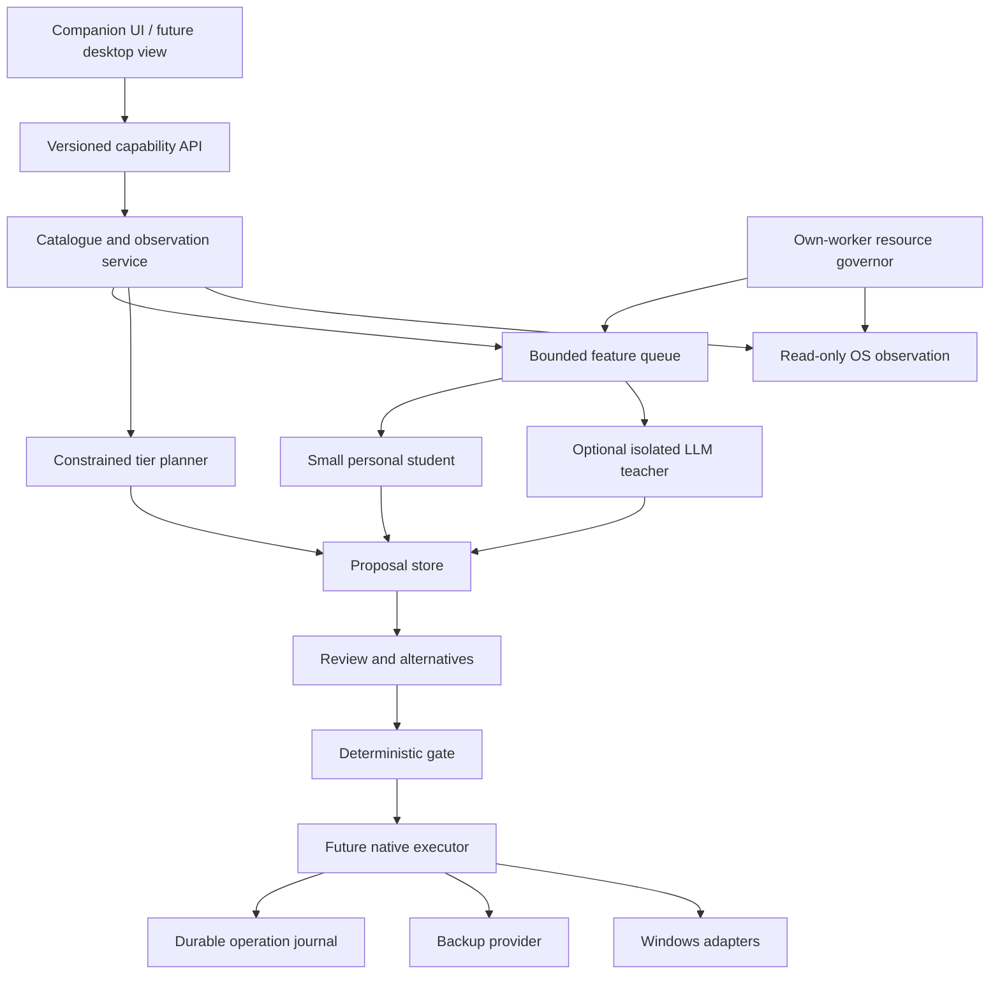

# Architecture and contracts

## Five independent dimensions
Every item can have a **meaning** (project/collection), **location** (physical volume/path), **lifecycle** (active, cooling, retained, unknown), **access interface** (ordinary path, shortcut, virtual collection entry) and **protection state** (backup/restore evidence). Do not collapse them into a single “folder.” A user can classify a document without moving it, archive a project without deleting it, and relocate a file without declaring it protected.

The catalogue links logical items to file objects and directory entries. The logical item can survive an explicitly recorded cross-volume copy; the native file identity cannot simply be reused on another volume. Hard-linked directory entries share a file object, but should not automatically share user-facing collection membership.



The `EX` mutation path is absent in the prototype. The UI can write feedback to its application database; this must not be confused with permission to write arbitrary files. The Rust policy source explicitly denies every mutation capability.

## Target processes
| Process | Privilege/lifetime | Owns | Does not own |
|---|---|---|---|
| Desktop shell | Standard user, visible/on demand | Presentation, keyboard/navigation, consent rendering | Raw Win32 mutation privileges |
| Catalogue engine | Standard user, per-user session | Inventory, scheduling, stable IDs, local SQLite | LLM parsing of raw documents in-process |
| Learning worker | Standard user, bounded subprocess | Feature transformation, student training/inference | Filesystem paths outside granted inputs |
| Teacher adapter | Optional, short lived | Schema request, bounded metadata transfer | Tools, commands, approvals, policy editing |
| Content workers | Isolated, bounded subprocesses | One supported extractor/parser at a time | Unrestricted traversal/network/elevation |
| Privileged broker | Future, just-in-time, narrow | Specific operations needing rights | General-purpose shell execution |

The Python HTTP server is a source-checkout workbench, not the proposed privileged or always-on production service. It binds to loopback, validates Host/Origin and requires a session token for API data. It has no production admission controller, installer, multi-user pipe ACL or native cancellation adapter. Never expose it to a LAN or run it as SYSTEM.

## Inventory pipeline
1. A user grants a root and read class. Resolve native identity and folder type; record the grant separately from a remembered display path.
2. Create an index generation with coverage `building`, observed volume identity and policy version.
3. Enumerate bounded metadata batches. Track object IDs separately from links/paths; reject unresolved/reparse/cloud cases for content access.
4. Commit batches through a bounded writer queue. Aggregates derive from a specific committed generation.
5. Start appropriate watchers and reconcile changes around the initial scan. Watchers are hints, not proof of completeness.
6. On restart or journal gap, mark affected coverage `stale` or `incomplete`, reconcile, then publish a new generation. Do not keep showing green “up to date.” [R05–R07]
7. Enrichment runs independently. A name-only index is useful before content hashes, embeddings or previews exist.

Choose direct directory enumeration first; add documented NTFS journal APIs as an optional accelerator. Do not implement a raw MFT parser merely to claim speed without a large malformed-record and Windows compatibility corpus. No automatic creation, resizing or deletion of the user's USN journal.

## Identity and timestamps
Production `ObjectRef = {volume_key, file_id_bytes, observation_generation}`. Pair it with current handle-derived facts at action time. File IDs can become stale across deletion/recreation or device changes, so an old database match is not sufficient authorization. A volume identity is not its drive letter. Device identity, partition identity and logical volume identity also differ.

Prototype IDs are path-derived observation keys. They are suitable for a review within a snapshot, not execution. Python snapshots contain nanosecond integers; JavaScript cannot represent all of those exactly. The Rust source uses decimal strings for nanoseconds. This mismatch is explicitly tolerated only for display/import. A production IPC revision must standardise exact integers as strings/typed binary and must never obtain action preconditions by round-tripping UI numbers.

Store monotonic sample durations and boot/session IDs for rates; UTC timestamps serve display and persisted chronology. Clock jumps must not produce negative elapsed time, accelerated cooldown expiry or accidental deletion eligibility.

## API model
Target envelope:
```json
{"protocol":"loomward/2","request_id":"opaque","session_id":"opaque","command":"inventory.query","scope_id":"opaque","expected_generation":"opaque","payload":{},"deadline_ms":2000}
```
An envelope never includes an arbitrary command line. The server resolves scope IDs, object IDs and predefined operations. Errors distinguish `permission_denied`, `capability_unavailable`, `stale_generation`, `device_offline`, `partial_coverage`, `resource_budget`, `cancelled` and `internal_error`.

Current workbench routes are deliberately smaller: GET `state`, `audit`, `feedback`; POST `label`, `train`, `rescan`, `duplicates`, `plan`, `processes`. Routes do not let the browser change the scan root or inject training provenance. There is no `execute`, `delete`, `shell`, `kill`, `uninstall` or `move` endpoint.

Future native IPC should use per-user access controls and authenticate the peer/session. Evaluate named pipes restricted to the current user SID, reject remote clients, verify integrity-level assumptions and minimise any elevated broker interface. A shared secret is not a replacement for correct pipe ACLs.

## Proposal record
A mature proposal includes `proposal_id`, scope, index generation, item/group IDs, operation kind, intended result, evidence references, explanation, alternatives, source/destination estimates, uncertainty, model/policy versions, preconditions, required grants, expiry, plan digest and recovery strategy. It can be `draft`, `needs_input`, `reviewable`, `approved`, `stale`, `rejected` or `superseded`. The explanation is not an executable plan.

A preview's plan digest covers ordered operations, exact source/destination identities, expected versions, byte limits, excluded items, metadata requirements and policy version. An approval references that digest. Any change in membership, destination or risk invalidates approval.

## Storage and resources
The local SQLite catalogue uses one controlled writer and bounded transactions; UI queries are paginated rather than receiving a million rows. Large content blobs are not stored in the transaction journal. Embeddings and features have explicit lifecycle/versioning and can be rebuilt. Keep active DB/WAL on local reliable storage [R22]. The draft future schema is in `schemas/catalogue-v2.sql`; it is not a migration for the prototype's feedback database.

Use separate queues for metadata, hashes, parsers, embeddings and teacher calls. Queue length, bytes, worker count and time all have budgets. Coalesce stale jobs by object/version, cancel enrichment for superseded objects, and prioritize foreground queries over background classification. Persistent worker state must not keep a multi-gigabyte model resident merely to label a new download.

## Extension boundaries
Providers advertise versioned capabilities: filesystem metadata, application ownership, backup/restore, resource policy, model lifecycle, desktop view. They receive scoped object references and bounded typed requests, not an all-powerful service handle. A future MCP interface should start read-only and not expose mutation solely because an agent is authenticated.
