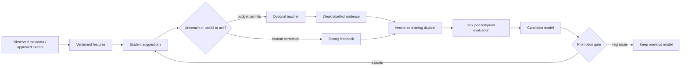

# Learning system: teacher, student and human feedback

## What is learned, and what is not
Learn the user's collection vocabulary, preference among valid organisational layouts, project/group affinities, access likelihood and possibly preferred trade-offs between valid plans. Do not learn permission to overwrite, delete, modify protected processes or relax filesystem invariants. Deterministic constraints are desirable at the safety boundary; avoiding all conditional logic would make the system less trustworthy, not more intelligent.

The LLM is a **noisy teacher**, not an oracle. Its reasoning ability can help interpret names, content descriptions and the user's expressed intent, but a plausible explanation does not prove the item belongs in a destination. Weak-supervision literature is a useful starting point [R30], not a validation of any particular model.

## Current executable baseline
`Student` is a weighted multinomial Naive Bayes model over bounded, presence-based tokens from filename, parent context, extension and a logarithmic size bucket. It fits real parameters from labelled examples. The prototype's default taxonomy is Documents, Finance, Media, Projects, Models and Archive. This is configurable in offline model input, not silently changed by the teacher.

Human events carry weight 1.0; teacher events carry 0.2. For an item, the newest human label takes precedence over teacher labels. A human retraction suppresses the item rather than resurrecting an old teacher decision. Event IDs and same-revision conflicts are validated. A fit only replaces the fitted model after the entire training set validates. Models serialise as inspectable JSON plus events, not arbitrary Python pickle.

The model explicitly abstains when there are no examples, fewer than four human-supported items, fewer than two human examples for the winning label, less than 35% known-feature coverage, a top relative score under 0.8, or a top-two margin under 0.2. These are conservative **reference heuristics**, not calibrated operating points. A non-abstaining result remains advice-only. The active-review score combines entropy, unfamiliarity and abstention evidence; it is a prioritisation baseline, not a proven optimal query policy.

The offline student accepts at most 10,000 raw events and a vocabulary budget of 100,000 terms. The UI and training limits must be displayed and evolved deliberately rather than bypassed when a dataset grows. Teacher execution is optional and CLI-only; the current UI does not secretly invoke a model or automatically ingest its labels.

## Intended loop

User interactions must distinguish “wrong collection,” “do not move it,” “not now,” “this is part of another project,” and “never inspect this scope.” Only the first is directly a label correction. Approval of an entire suggested batch is not necessarily a high-quality per-file label for every hidden item. Asking useful questions is part of the product: identify the smallest clarification likely to resolve several related items.

## Data records
A learning event has a stable logical item ID, feature version, label/taxonomy version, source (`human` or `teacher`), actor class, event ID, revision, observation generation, model/prompt IDs where relevant, timestamp and retraction state. The raw teacher response, sanitised accepted record and human override must be distinguishable. Do not store private chain-of-thought as a product dependency; a short user-facing reason and cited input fields suffice.

Keep preference statements separate from training examples. “Keep current projects on the SSD” is an explicit user constraint with a version and scope. A model should not erase it by accumulating contrary weak labels. Imported recipes are untrusted proposed preferences and need review.

## Cold start and richer representations
Start with virtual collections the user understands, extension/name baselines and examples from an explicitly selected scope. Offer suggested taxonomy names as a draft, not a mass reorganisation. The system should remain useful without any LLM model installed.

The next representation experiment is a small local embedding model plus a linear classifier or nearest-centroid retrieval, compared against the existing baseline on the same held-out data. Content embeddings are opt-in and require supported extractors. Add tabular features only when they have useful provenance: application ownership, project anchors, dependency relationships, measured access coverage, file-type confidence and group membership. Do not convert an unknown access signal to “cold.”

Clustering is discovery, not authority. It can propose “these files seem related” and invite a group name. It must not silently assign physical folders, move connected files, or regard every adjacent filename as the same project.

## Learning access heat
A file's next-use probability and cost of retrieving it from a slower disk are separate predictions. Use observed app-open events, user pins, explicitly instrumented workflows, recent working-set membership and provider signals. NTFS journals record changes, not a complete history of reads [R05,R06]. Timestamp-only labels are weak and may be misleading [R12]. Store observation coverage and censoring: a machine that was off or unobserved did not prove that a file was unwanted.

Begin with interpretable recency/count features and a bounded horizon such as 7 or 30 days. Compare a simple decay model against logistic/gradient-boosted or survival approaches when there is enough data. Include uncertainty and abstention. Avoid a giant end-to-end RL agent that experiments by moving or deleting real files.

## Evaluation and promotion
Use group-aware and time-aware splits. Keep near-duplicate documents, revisions of the same file and members of one project from leaking across train/test splits. Maintain a small human-labelled holdout, label provenance and privacy boundaries. Measure macro-F1, per-label precision/recall, top-k utility, coverage at abstention, selective error, correction rate and user interruption cost. For calibrated classifiers, evaluate reliability, Brier score and calibration error with uncertainty estimates [R31]. A 0.98 score on a small sample is not a 98% chance an action is safe.

Compare name/extension heuristics, this student, embedding-based alternatives and teacher-only suggestions using identical scopes. Separate teacher label accuracy from student imitation accuracy. A student perfectly imitating a mistaken teacher is still mistaken.

Promote a model only after a versioned evaluation report, no severe regressions on protected/unknown cases, and a bounded shadow period. Preserve the prior model and dataset manifest for rollback. Initial promotion is manual. Keep a reason for each threshold; do not invent a confidence floor that merely makes a demo look autonomous.

## Active learning and question budgets
Rank questions by uncertainty, expected reduction in repeated work, number of affected items and potential harm of a mistaken suggestion. Cap interruptions, allow a quiet schedule and batch similar questions. User nonresponse is not a negative label. Provide “show two valid structures,” “keep this project together,” and “ask me once per batch” alternatives. A future preference model can learn how the user chooses among already-safe plans, but should never explore a dangerous plan to improve its reward.

## Privacy, deletion and model lifecycle
Separate demo and personal profiles. Synthetic data must never silently enter personal evaluation. Exclude sensitive scopes before feature extraction, not only before network transfer. Support exporting and retracting labels, deleting derived features, refitting after erasure and disabling individual providers. In-memory caches and backups of model artifacts need the same lifecycle thinking.

The permanent service should not require an LLM resident in RAM/VRAM. Batch uncertain examples, use a model-load lease, respect the user's other model sessions, set idle expiry where supported, and release only resources Loomward actually owns [R29]. Benchmark latency and footprint of the full pipeline, including the model server, rather than the tiny classifier alone.
