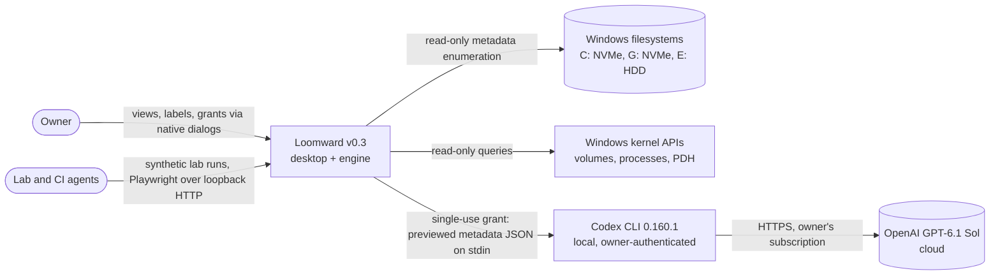
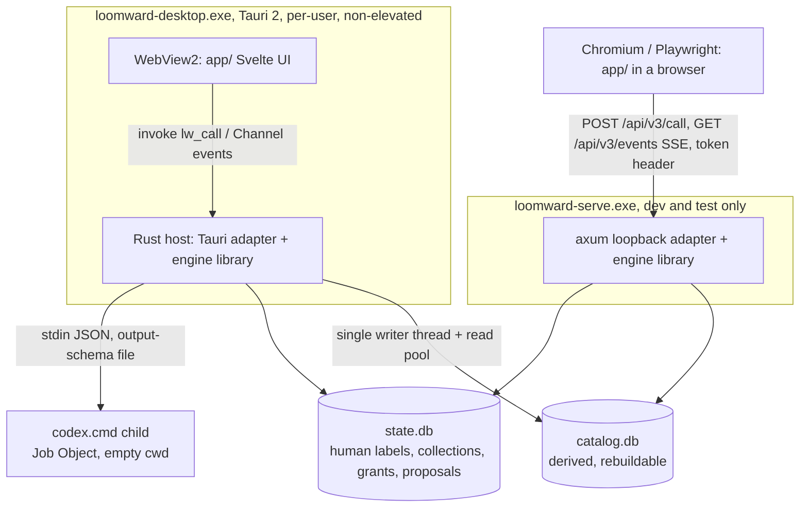
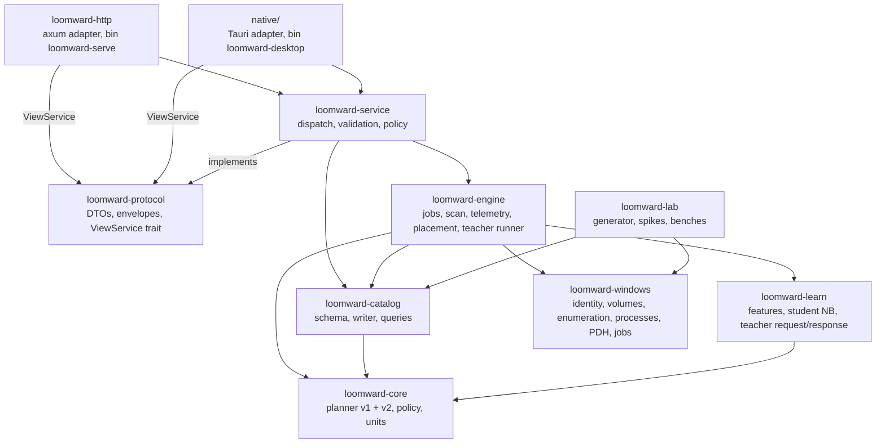
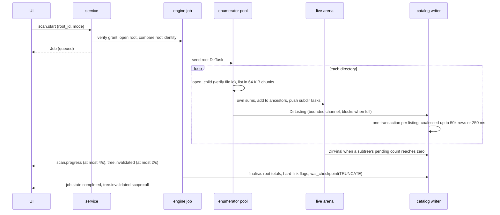
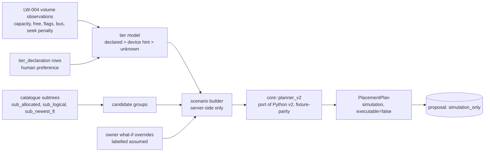
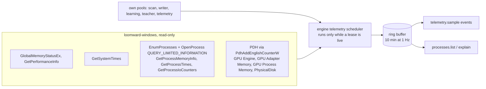

# Loomward v0.3 architecture: the "Woven" programme

Status: **proposed** (2026-10-09). Decisions are recorded in [42](42-v03-adrs.md); the parallel plan is
[43](43-v03-lanes.md); the wire contract is [`contracts/v3/`](../contracts/v3/). This document is the contract
other agents implement against. Where it says "pending the spike", the named default holds until a measured
result replaces it. Nothing here changes the product invariants in `AGENTS.md`; v0.3 moves, deletes, kills,
suspends, reprioritises and trims nothing. Every balancing or resource output is a simulation or a proposal.

## 1. Frame

**Problem.** v0.2 is a tested Python reference with a generic browser UI and an uncompiled-until-today Rust
foundation. The owner wants all four pillars at once: (a) a native engine that inventories disks far faster than
WinDirStat with real identity, volume capabilities and a persistent catalogue, under a new signature UI; (b)
organisation and learning with a Rust-resident student and an optional GPT-6.1 Sol teacher; (c) storage
balancing simulated against the real C:, G: and E: volumes; (d) a read-only resource companion. Plus a lab for
synthetic, scale and stress testing.

**Forces.** One owner, many parallel agents (4 Sol, 2 Opus, 2 Sonnet, Haiku and Muse swarms), Windows 11 host,
public MIT repo, three workers already building `loomward-windows`, `loomward-lab` and `app/prototype/`. Rust
1.97, Node 24, Python 3.14 measured. The UI must grow with the engine, so the contract between them must be
stable before either side is finished.

**Quality attributes, ranked.**

1. **Correctness and honesty** (invariants 4, 9): totals match the filesystem or say why not; unknown stays
   unknown; simulations are labelled.
2. **Security and privacy** (invariants 1, 2, 3, 5, 7): no effect surface, no silent reach, grants from native
   surfaces only, disclosure bounded and previewed.
3. **Performance**: scan throughput, bounded memory at 10M entries, interactive slices.
4. **Maintainability**: disjoint lanes, one owner per contract, cross-language oracles.
5. **Operability**: self-health, cancellation, recoverable state.
6. **Cost**: one process, no servers, no paid services beyond the owner's existing Codex subscription.

The two that drive this design are **correctness** and **performance at 10M entries**; security is a hard
constraint rather than a trade-off axis.

**Hard constraints.** Invariants 1-9; non-elevated operation; no automatic cloud requests; Python remains the
reference; v1 planner and its 51-case counterexample stay; `handoff/v1/` untouched; synthetic and personal
evidence never mix. **Preferences.** Svelte 5 for the shell; Canvas for heavy visuals; Rust for the engine.

## 2. Context (C4 level 1)



The only egress path is Loomward to Codex to OpenAI, and only through `teacher.run` with a single-use
disclosure grant (section 9). Everything else stays on the machine.

## 3. Containers (C4 level 2)



| Container | Process | Owns | Must not own |
|---|---|---|---|
| Desktop shell | `loomward-desktop.exe` (Tauri 2), standard user | Native folder picker, disclosure confirmation dialog, window, IPC adapter | Any webview-supplied path; any effect command |
| Engine library | In-process inside the shell or `loomward-serve` | Scans, catalogue, jobs, telemetry sampling, learning, placement simulation | Elevation, file handles opened for content, process control of others |
| Browser adapter | `loomward-serve.exe`, loopback only, CLI-launched | HTTP + SSE transport for dev, Playwright, agents | Root grants (CLI flags only), personal disclosure grants |
| `catalog.db` | SQLite file | Volumes, grants' observed roots, dir/file rows, aggregates, scan runs | Anything that cannot be rebuilt by rescanning |
| `state.db` | SQLite file | Human feedback, teacher labels, taxonomy, collections, disclosure grants, teacher requests, saved simulations, tier declarations | Filesystem observations |
| Teacher child | `codex.cmd exec` under a Job Object | One request, one response | Tools, files, retries, a second request |

**The engine runs in-process** (ADR-V3-01). The service boundary is a Rust trait, so moving the engine into its
own process later (LW-017, named pipe) is an adapter change, not a redesign. Two instances on one dataset class
are prevented by an exclusive lock file in the state directory (`busy` error to the second).

**State directories.** `%LOCALAPPDATA%\Loomward\v3\<dataset_class>\{catalog.db, state.db, teacher\, lock}` by
default; `--state-dir` overrides (the lab uses `G:\loomward-lab\state\`). A root that contains, or is contained
by, the state directory is refused at grant time and the state directory is excluded by file identity during
scans. State is never committed (`*.db` is gitignored; `.loomward/` too).

## 4. Components (C4 level 3: inside the engine library)



Dependencies point one way: adapters to service to engine to leaves. Leaves (`core`, `learn`, `windows`) never
depend on the engine. `loomward-windows` is the only crate with `unsafe` and Win32 calls; every other crate keeps
`#![forbid(unsafe_code)]`.

| Crate | Responsibility | Key modules | Must not |
|---|---|---|---|
| `loomward-core` (exists) | Pure domain: planner v1 (unchanged), planner v2 port, capability policy, unit types | `planner.rs`, `planner_v2.rs`, `policy.rs`, `units.rs` | IO, threads, Win32 |
| `loomward-windows` (in flight, W0-A) | Read-only Win32: handle-derived identity, volumes and device hints, directory enumeration strategies, processes, PDH counters, owned-child Job Objects | `identity.rs`, `volumes.rs`, `enumerate/`, `processes.rs`, `pdh.rs`, `jobs.rs` | Any write, delete, rename, kill, suspend, priority or trim call on anything Loomward did not spawn; elevation |
| `loomward-lab` (in flight, W0-B) | Deterministic synthetic trees, enumeration spike, benches, hostile-name corpus | `gen/`, `spike/`, `bench/` | Ship in the desktop app; touch paths outside its lab root |
| `loomward-catalog` | SQLite schema and migrations, the single writer thread, read pool, slice/children/search/breakdown queries, accounting | `schema/`, `writer.rs`, `read.rs`, `slice.rs`, `search.rs`, `accounting.rs`, `migrate.rs` | Enumerate the filesystem; know about HTTP or Tauri |
| `loomward-learn` | Feature extraction from catalogue rows, weighted NB student (port), teacher request building and strict response validation | `features.rs`, `student.rs`, `teacher_payload.rs`, `teacher_validate.rs` | Spawn processes; touch the network; read file contents |
| `loomward-engine` | Job manager, cancellation, scan pipeline, live aggregate arena, event bus, telemetry scheduler, placement scenario builder, learning jobs, teacher runner, own-pool budgets | `jobs/`, `scan/`, `events.rs`, `telemetry/`, `placement/`, `learning/`, `teacher/`, `budgets.rs` | Expose a generic command; accept paths from callers |
| `loomward-protocol` | Rust mirror of `contracts/v3`: envelopes, every request/result/event DTO, bounds validation, `ViewService` trait | `envelope.rs`, `dto/`, `service.rs` | Business logic |
| `loomward-service` | Implements `ViewService`: decode, validate, check grants and dataset class, call engine/catalog, map to DTOs, mint opaque IDs | `dispatch.rs`, `ids.rs`, `policy.rs`, `commands/` | Transport concerns |
| `loomward-http` | `loomward-serve` binary: loopback bind, token, Host/Origin checks, body limits, SSE, static `app/dist` | `main.rs`, `auth.rs`, `sse.rs` | Bind non-loopback; grant roots except via `--grant-root` |
| `native/` | Tauri 2 shell: `lw_call`, `lw_events` Channel, native picker and confirmation dialogs | `src/main.rs`, `src/dialogs.rs` | Expose fs/shell/http/process plugins to the webview |

**Workspace.** The coordinator switches the root `Cargo.toml` to `members = ["crates/*"]` (no per-lane edits to
the member list) and pre-declares every approved dependency in `[workspace.dependencies]` (ADR-V3-02). `native/`
stays excluded from the root workspace (WebKit/WebView2 build cost on the ubuntu leg) and depends on workspace
crates by path. Every crate builds on ubuntu: Win32 code is `#[cfg(windows)]` with explicit `Unsupported` stubs,
and the engine carries a portable `std::fs::read_dir` source so scan tests run on both CI legs.

### 4.1 What the engine needs from `loomward-windows`

The engine owns this seam (`crates/loomward-engine/src/scan/source.rs`). If the W0-A/W0-B code ships different
names, the adapter goes in that file; the in-flight workers do not have to match these names, only these facts.

```rust
pub trait DirSource: Send + Sync {
    type Dir: Send;
    fn strategy(&self) -> EnumerationStrategy;
    /// Open the granted root without following a reparse point; return its handle-derived identity.
    fn open_root(&self, root: &GrantedRoot) -> Result<(Self::Dir, ObservedIdentity), SourceError>;
    /// Stream every entry of `dir` in buffer-sized chunks. Never opens a handle on a file. Never reads content.
    fn list(&self, dir: &Self::Dir, sink: &mut dyn FnMut(RawEntry<'_>) -> Flow) -> Result<ListOutcome, SourceError>;
    /// Open a child directory (FILE_LIST_DIRECTORY | SYNCHRONIZE, BACKUP_SEMANTICS | OPEN_REPARSE_POINT,
    /// share all) and verify its file ID equals the one its parent listed; mismatch is `IdentityChanged`.
    fn open_child(&self, parent: &Self::Dir, entry: &RawEntry<'_>) -> Result<Self::Dir, SourceError>;
}
pub struct RawEntry<'a> {
    pub name: &'a [u16],              // exact UTF-16, may hold unpaired surrogates
    pub file_id: Option<[u8; 16]>,    // FILE_ID_128 when the strategy provides it
    pub attributes: u32,
    pub reparse_tag: Option<u32>,
    pub end_of_file: u64,
    pub allocation_size: Option<u64>,
    pub creation: i64, pub last_write: i64, pub change: i64, pub last_access: i64, // FILETIME ticks
}
pub enum Flow { Continue, Stop }      // Stop = cancellation observed mid-listing
```

From LW-003 (`identity.rs`): `observe_handle(&Handle) -> ObservedIdentity { volume_serial: u64, file_id:
[u8; 16], quality }` via `GetFileInformationByHandleEx(FileIdInfo)`; quality `native_file_id_128`,
`native_file_id_64` or `unavailable`. **Identity is an observation, not a grant**: no function in the crate
accepts an identity and returns a capability.

From LW-004 (`volumes.rs`): `list() -> Vec<VolumeObservation>` with volume GUID path, mount points, filesystem
name, label, 64-bit serial (joins to `FileIdInfo.VolumeSerialNumber`), capacity, caller-visible free bytes,
`FILE_SUPPORTS_*` flags, online/read-only/removable, and a `DeviceHint { bus_type, seek_penalty, disk_numbers }`
from `IOCTL_STORAGE_QUERY_PROPERTY` (`StorageDeviceProperty`, `StorageDeviceSeekPenaltyProperty`) and
`IOCTL_VOLUME_GET_VOLUME_DISK_EXTENTS`. The volume key (`volume_key`) is the serial plus the GUID path, never a
drive letter (LW-004 acceptance: a drive-letter remap does not reuse the old identity).

**Enumeration strategy: pending the LW-101 spike's measurement, default `file_id_extd_directory_info`.** That is
`GetFileInformationByHandleEx(FileIdExtdDirectoryInfo)` on an open directory handle (documented Win32, Windows 8+);
the spike's `NtQueryDirectoryFileEx(FileIdExtdDirectoryInformation)` returns the same record shape and may replace
it if measurably faster. The default is chosen for **information**, not only speed: it is the one bulk call that
returns the 128-bit file ID, sizes, allocation, attributes, reparse tag and all four timestamps per entry, so the
catalogue gets identity for 10M entries without 10M handle opens. Fallback for volumes without 128-bit IDs
(FAT32, exFAT, some network or virtual filesystems): `FindFirstFileExW(FindExInfoBasic,
FIND_FIRST_EX_LARGE_FETCH)` with identity quality `path_observation`. `std::fs::read_dir` is the portable CI
source only. Raw MFT reads and `FSCTL_ENUM_USN_DATA` are out: both need an elevated volume handle (invariant 2)
and doc 04 forbids an MFT parser without a malformed-record corpus (ADR-V3-05).

## 5. The view-model service contract

Machine-readable: [`contracts/v3/view-service.schema.json`](../contracts/v3/view-service.schema.json) (every
payload as `$defs`) and [`contracts/v3/commands.json`](../contracts/v3/commands.json) (command to request/result
binding, adapters, wave, events). A Rust implementer reads `$defs` and writes `loomward-protocol`; a TypeScript
implementer consumes the generated `app/src/lib/contracts.gen.ts`. Neither needs the other.

### 5.1 Envelope and transports

```json
{"protocol":"loomward/3","request_id":"r_000017","command":"tree.slice","payload":{...},"deadline_ms":2000}
{"protocol":"loomward/3","request_id":"r_000017","ok":true,"result":{...},"meta":{"served_at":"...","elapsed_ms":14,"dataset_class":"synthetic","budget_hit":false}}
{"protocol":"loomward/3","request_id":"r_000017","ok":false,"error":{"code":"stale_generation","message":"...","retryable":true,"detail":null}}
{"protocol":"loomward/3","seq":4211,"event":"scan.progress","at":"...","data":{...}}
```

| | Desktop (Tauri 2) | Browser (`loomward-serve`) |
|---|---|---|
| Call | `invoke('lw_call', { request })` returns the response envelope | `POST /api/v3/call`, JSON body at most 64 KiB, header `X-Loomward-Token`, always HTTP 200 with an envelope; 400/403/413/415 only for transport faults |
| Events | `invoke('lw_events', { channel, lastSeq })`, a Tauri `Channel<EventEnvelope>` | `GET /api/v3/events`, SSE, token header, optional `Last-Event-ID`; read with `fetch` streaming, not `EventSource` (which cannot send headers) |
| Auth | In-process IPC; no token | 256-bit random token printed once as `http://127.0.0.1:PORT/#token=...` (fragment, never sent); constant-time compare |
| Grants | Native folder picker; native disclosure confirmation | Roots only from `--grant-root <dir>` flags; personal disclosure refused |

**One rule for numbers (ADR-V3-04).** Every byte quantity is a decimal string (`ByteCount`); `null` means
unknown. Bounded counts are JSON integers. Timestamps are RFC 3339 UTC strings. IDs are opaque prefixed strings
(`rt_`, `vo_`, `nd_`, `jb_`, `gr_`, ...). The TS client converts bytes to `number` only for layout and display,
in one helper. No command accepts a path string; `DisplayPath` is output-only.

**Errors.** `invalid_request`, `unsupported_protocol`, `unknown_command`, `not_found`, `permission_denied`,
`capability_unavailable`, `stale_generation`, `device_offline`, `partial_coverage`, `resource_budget`, `busy`,
`cancelled`, `deadline_exceeded`, `internal_error`. Unknown fields fail closed (`invalid_request`).

**Bounds.** Request 64 KiB; slice at most 6,000 nodes (default 2,500); pages at most 200 items; search at most
100; teacher batches at most 25 items; event queue 1,024 per subscriber, overflow yields `stream.lagged` and the
client refetches. Long work never blocks a call: it returns a `Job` and reports by events.

### 5.2 Commands

All 45 commands have `effects: none`. Bold rows exist only on the desktop adapter.

| Area | Command | Request | Result | Notes |
|---|---|---|---|---|
| Session | `session.hello` | `EmptyRequest` | `SessionInfo` | Protocol, adapter, dataset class, enumeration strategy, capability matrix with every effect `false`, limits |
| | `health.get` | `EmptyRequest` | `Health` | Engine memory/CPU, catalogue size, writer queue, warnings |
| Roots | `roots.list` | `EmptyRequest` | `RootList` | |
| | **`roots.request_grant`** | `RootGrantRequest` | `RootGrantResult` | Rust opens the folder picker; refuses volume roots, reparse/placeholder roots, overlap with state dir or another root |
| | `roots.revoke` | `RootRevokeRequest` | `RootRevokeResult` | `purge_catalog` deletes Loomward's rows only |
| Volumes | `volumes.list` | `EmptyRequest` | `VolumeList` | Device hints are hints, not speeds |
| | `volumes.declare_tier` | `DeclareTierRequest` | `DeclareTierResult` | Human preference (append-only) |
| Scan | `scan.start` | `ScanStartRequest` | `JobResult` | `full` or `refresh`; optional budget |
| | `scan.cancel` | `JobRefRequest` | `JobResult` | Acknowledged at once as `cancel_requested` |
| | `jobs.get` / `jobs.list` | `JobRefRequest` / `JobListRequest` | `JobResult` / `JobList` | |
| Tree | `tree.slice` | `TreeSliceRequest` | `TreeSlice` | Bounded, flattened tree for treemap and sunburst (section 8) |
| | `tree.children` | `TreeChildrenRequest` | `EntryPage` | Keyset-paged table rows |
| | `tree.path` | `NodeRefRequest` | `NodePath` | Breadcrumb |
| | `node.inspect` | `NodeRefRequest` | `NodeDetail` | Identity observation (`authorises_effects: false`), timestamps, exclusions, denied capabilities, memberships, suggestion |
| | `threads.meaning` | `MeaningRequest` | `MeaningResult` | Lazy meaning thread for slice nodes (wave 3) |
| | `search.query` | `SearchRequest` | `EntryPage` | Bounded substring/extension/min-size; `budget_hit` instead of a silent empty result |
| | `stats.breakdown` | `BreakdownRequest` | `Breakdown` | By extension family, extension or age band |
| Learning | `taxonomy.get` | `EmptyRequest` | `Taxonomy` | |
| | `feedback.record` | `FeedbackRequest` | `FeedbackResult` | Human data class only |
| | `learning.status` / `learning.queue` / `learning.refit` | | `LearningStatus` / `LearningQueue` / `JobResult` | Review desk |
| | `collections.list` / `.create` / `.update_members` / `.members` | | `CollectionList` / `Collection` / `Collection` / `EntryPage` | Virtual membership in `state.db` |
| Teacher | `teacher.preview` | `TeacherPreviewRequest` | `TeacherPreview` | Exact payload, digest, expiry; sends nothing |
| | `grants.create_disclosure` | `DisclosureGrantRequest` | `DisclosureGrantResult` | Personal: native dialog (desktop only); synthetic: policy grant |
| | `grants.list` / `grants.revoke` | | `GrantList` / `GrantRevokeResult` | Root and disclosure grants |
| | `teacher.run` | `TeacherRunRequest` | `JobResult` | The only egress; single-use grant; no item list accepted |
| | `teacher.results` | `JobRefRequest` | `TeacherResults` | `data_class: teacher`, weight 0.2, `requires_review: true` |
| Placement | `tiers.model` | `EmptyRequest` | `TierModel` | Declared tier, device hint, pressure state |
| | `placement.candidates` | `PlacementCandidatesRequest` | `PlacementCandidates` | Groups from catalogue subtrees; heat `unknown` by default |
| | `placement.simulate` | `PlacementSimulateRequest` | `PlacementPlan` | v2 allocator in Rust; `filesystem_changed: false`, `executable: false` |
| | `proposals.list` / `proposals.get` | | `ProposalList` / `ProposalDetail` | Saved simulations only; no approve |
| Companion | `telemetry.subscribe` / `.unsubscribe` / `.snapshot` | | `TelemetrySubscription` / `TelemetryUnsubscribed` / `TelemetrySample` | 60 s renewable lease; sampler idles with no lease |
| | `processes.list` / `processes.explain` | | `ProcessList` / `ProcessExplanation` | Read-only; `available_actions` is always empty |
| | `budgets.get` / `budgets.set` | | `OwnBudgets` | Loomward's own pools only |

**Events.** `stream.hello`, `stream.lagged`, `job.state`, `scan.progress` (at most 4/s per job),
`tree.invalidated` (at most 2/s per root), `telemetry.sample`, `learning.updated`, `roots.changed`,
`volumes.changed`, `health.warning`. Payload bindings are in `commands.json`.

**Contract tests that must exist** (lane L1): every example in `contracts/v3/examples/` validates against its
`$def` and round-trips through the Rust DTO byte-for-byte after canonicalisation; the TS types compile; no
command name matches `(delete|move|rename|kill|exec|shell|trim|suspend|priority|uninstall|write_file|run_command)`;
every `effects` capability in `Capabilities` is the constant `false`; the HTTP adapter returns
`capability_unavailable` for `roots.request_grant`.

### 5.3 The service trait

```rust
// crates/loomward-protocol/src/service.rs
pub trait ViewService: Send + Sync + 'static {
    /// Synchronous and bounded by the request deadline; long work returns a Job.
    fn call(&self, request: RequestEnvelope, ctx: &CallContext) -> ResponseEnvelope;
    /// Bounded per-subscriber queue; replays from `last_seq` when still buffered, else starts with stream.lagged.
    fn subscribe(&self, last_seq: Option<u64>) -> EventSubscription;
}
pub struct CallContext { pub adapter: Adapter, pub dialogs: Option<std::sync::Arc<dyn NativeDialogs>> }
pub enum Adapter { Tauri, Http }
pub trait NativeDialogs: Send + Sync {
    fn pick_folder(&self) -> Option<std::path::PathBuf>;            // Rust-side picker; path never crosses IPC
    fn confirm_disclosure(&self, summary: &DisclosureSummary) -> bool; // native modal, exact fields and item count
}
```

Adapters run `call` on a blocking pool (`spawn_blocking`) and pump `EventSubscription` into the SSE response or
the Tauri `Channel`. `RequestEnvelope.payload` arrives as `serde_json::Value` and is decoded per command into a
`#[serde(deny_unknown_fields)]` DTO.

## 6. Persistent catalogue (schema v3)

Two SQLite files per dataset class (ADR-V3-06, ADR-V3-15), `rusqlite` with bundled SQLite, `STRICT` tables,
WAL, `synchronous=NORMAL`, `foreign_keys=ON`, `application_id = 0x4C4D5752` ("LMWR"), `user_version` = migration
number. Open refuses a foreign `application_id`, a newer `user_version`, or a network path (LW-005). Migrations
are transactional and take a `VACUUM INTO` copy of `state.db` first. `PRAGMA quick_check` runs at open; a corrupt
`catalog.db` is renamed aside and rebuilt by rescanning, because nothing in it is precious; `state.db` is small,
precious and backed up by `VACUUM INTO` before every migration.

Wire values are decimal strings; storage is `INTEGER` (signed 64-bit; sizes above 2^63-1 are rejected as
`invalid` observations, which no NTFS file reaches). Timestamps are FILETIME ticks (`*_ft`) as observed.

```sql
-- catalog.db: derived, rebuildable. Migration 1.
CREATE TABLE meta (key TEXT PRIMARY KEY, value TEXT NOT NULL) STRICT; -- dataset_class, instance_id, engine_version
CREATE TABLE volume (
  id INTEGER PRIMARY KEY, volume_key TEXT NOT NULL UNIQUE, display_name TEXT NOT NULL,
  identity_json TEXT NOT NULL, capabilities_json TEXT NOT NULL, device_json TEXT NOT NULL,
  online INTEGER NOT NULL CHECK (online IN (0,1)), observed_at_ns INTEGER NOT NULL) STRICT;
CREATE TABLE root_grant (
  id INTEGER PRIMARY KEY, volume_id INTEGER REFERENCES volume(id),
  root_file_id BLOB CHECK (root_file_id IS NULL OR length(root_file_id) = 16),
  display_path TEXT NOT NULL,
  origin TEXT NOT NULL CHECK (origin IN ('fixture','lab_generated','owner_granted')),
  granted_via TEXT NOT NULL CHECK (granted_via IN ('desktop_picker','cli_flag','fixture')),
  state TEXT NOT NULL CHECK (state IN ('active','revoked','identity_changed')),
  granted_at_ns INTEGER NOT NULL, revoked_at_ns INTEGER) STRICT;
CREATE TABLE scan_run (
  id INTEGER PRIMARY KEY, grant_id INTEGER NOT NULL REFERENCES root_grant(id),
  mode TEXT NOT NULL CHECK (mode IN ('full','refresh')), strategy TEXT NOT NULL,
  state TEXT NOT NULL CHECK (state IN ('running','cancelled','failed','completed')),
  started_at_ns INTEGER NOT NULL, finished_at_ns INTEGER,
  counters_json TEXT NOT NULL, budget_json TEXT NOT NULL, error_json TEXT) STRICT;
CREATE TABLE ext (id INTEGER PRIMARY KEY, ext TEXT NOT NULL UNIQUE, family TEXT NOT NULL) STRICT;
CREATE TABLE dir (
  id INTEGER PRIMARY KEY, grant_id INTEGER NOT NULL REFERENCES root_grant(id) ON DELETE CASCADE,
  parent_id INTEGER REFERENCES dir(id) ON DELETE CASCADE,          -- NULL only for the grant root
  name TEXT NOT NULL, name_utf16 BLOB,                             -- raw UTF-16LE only when lossy
  file_id BLOB CHECK (file_id IS NULL OR length(file_id) = 16),
  depth INTEGER NOT NULL, attrs INTEGER NOT NULL, reparse_tag INTEGER, flags INTEGER NOT NULL DEFAULT 0,
  created_ft INTEGER, modified_ft INTEGER, changed_ft INTEGER,
  state TEXT NOT NULL CHECK (state IN ('complete','partial','denied','excluded','unscanned','stale','cancelled')),
  seen_run INTEGER NOT NULL, listing_rev INTEGER NOT NULL DEFAULT 0,
  own_files INTEGER NOT NULL DEFAULT 0, own_logical INTEGER NOT NULL DEFAULT 0,
  own_allocated INTEGER NOT NULL DEFAULT 0, own_alloc_unknown INTEGER NOT NULL DEFAULT 0,
  own_skipped INTEGER NOT NULL DEFAULT 0, own_errors INTEGER NOT NULL DEFAULT 0,
  sub_files INTEGER NOT NULL DEFAULT 0, sub_dirs INTEGER NOT NULL DEFAULT 0,
  sub_logical INTEGER NOT NULL DEFAULT 0, sub_allocated INTEGER NOT NULL DEFAULT 0,
  sub_alloc_unknown INTEGER NOT NULL DEFAULT 0, sub_skipped INTEGER NOT NULL DEFAULT 0,
  sub_errors INTEGER NOT NULL DEFAULT 0, sub_newest_ft INTEGER,
  sub_complete INTEGER NOT NULL DEFAULT 0 CHECK (sub_complete IN (0,1))) STRICT;
CREATE INDEX dir_by_logical   ON dir(parent_id, sub_logical DESC);
CREATE INDEX dir_by_allocated ON dir(parent_id, sub_allocated DESC);
CREATE UNIQUE INDEX dir_identity ON dir(grant_id, file_id) WHERE file_id IS NOT NULL;
CREATE TABLE file (
  id INTEGER PRIMARY KEY, dir_id INTEGER NOT NULL REFERENCES dir(id) ON DELETE CASCADE,
  name TEXT NOT NULL, name_utf16 BLOB, ext_id INTEGER REFERENCES ext(id),
  file_id BLOB CHECK (file_id IS NULL OR length(file_id) = 16),
  logical INTEGER NOT NULL, allocated INTEGER,                      -- NULL allocated = unknown
  created_ft INTEGER, modified_ft INTEGER, changed_ft INTEGER, accessed_ft INTEGER,
  attrs INTEGER NOT NULL, reparse_tag INTEGER, flags INTEGER NOT NULL DEFAULT 0,
  seen_run INTEGER NOT NULL) STRICT;
CREATE INDEX file_by_logical ON file(dir_id, logical DESC);
CREATE INDEX file_by_ext     ON file(ext_id, logical DESC);
CREATE INDEX file_identity   ON file(file_id) WHERE file_id IS NOT NULL; -- hard links share an ID

-- state.db: precious, small. ATTACHed as `st` by the writer and the read pool.
CREATE TABLE meta (key TEXT PRIMARY KEY, value TEXT NOT NULL) STRICT;
CREATE TABLE object_ref (                     -- durable reference that survives rescans and moves
  id INTEGER PRIMARY KEY, volume_key TEXT NOT NULL, file_id BLOB NOT NULL CHECK (length(file_id) = 16),
  kind TEXT NOT NULL CHECK (kind IN ('file','dir')), UNIQUE (volume_key, file_id)) STRICT;
CREATE TABLE taxonomy (version INTEGER PRIMARY KEY, labels_json TEXT NOT NULL, created_at_ns INTEGER NOT NULL) STRICT;
CREATE TABLE human_feedback (
  id INTEGER PRIMARY KEY, event_id TEXT NOT NULL UNIQUE, object_ref_id INTEGER NOT NULL REFERENCES object_ref(id),
  revision INTEGER NOT NULL CHECK (revision > 0), label TEXT, retracted INTEGER NOT NULL CHECK (retracted IN (0,1)),
  taxonomy_version INTEGER NOT NULL REFERENCES taxonomy(version), features_json TEXT NOT NULL,
  recorded_at_ns INTEGER NOT NULL) STRICT;
CREATE TABLE disclosure_grant (
  id INTEGER PRIMARY KEY, recipient TEXT NOT NULL, fields_json TEXT NOT NULL, item_count INTEGER NOT NULL,
  payload_digest TEXT NOT NULL, confirmed_via TEXT NOT NULL CHECK (confirmed_via IN ('desktop_dialog','synthetic_policy')),
  created_at_ns INTEGER NOT NULL, expires_at_ns INTEGER NOT NULL, revoked_at_ns INTEGER, used_at_ns INTEGER) STRICT;
CREATE TABLE teacher_request (
  id INTEGER PRIMARY KEY, grant_id INTEGER NOT NULL UNIQUE REFERENCES disclosure_grant(id),
  payload_json TEXT NOT NULL, payload_digest TEXT NOT NULL, handle_map_json TEXT NOT NULL,
  state TEXT NOT NULL, started_at_ns INTEGER, finished_at_ns INTEGER, response_digest TEXT, rejection TEXT) STRICT;
CREATE TABLE teacher_label (                  -- a separate table: teacher labels are never human feedback
  id INTEGER PRIMARY KEY, request_id INTEGER NOT NULL REFERENCES teacher_request(id),
  object_ref_id INTEGER NOT NULL REFERENCES object_ref(id), label TEXT, abstain INTEGER NOT NULL,
  reason TEXT NOT NULL, evidence_json TEXT NOT NULL, taxonomy_version INTEGER NOT NULL,
  features_json TEXT NOT NULL, received_at_ns INTEGER NOT NULL) STRICT;
CREATE TABLE student_model (
  id TEXT PRIMARY KEY, algorithm TEXT NOT NULL, taxonomy_version INTEGER NOT NULL, dataset_digest TEXT NOT NULL,
  training_count INTEGER NOT NULL, state_json TEXT NOT NULL,
  status TEXT NOT NULL CHECK (status IN ('candidate','active','retired')), fitted_at_ns INTEGER NOT NULL) STRICT;
CREATE TABLE collection (
  id INTEGER PRIMARY KEY, name TEXT NOT NULL UNIQUE, kind TEXT NOT NULL CHECK (kind IN ('human','label_view')),
  created_at_ns INTEGER NOT NULL) STRICT;
CREATE TABLE collection_member (
  collection_id INTEGER NOT NULL REFERENCES collection(id) ON DELETE CASCADE,
  object_ref_id INTEGER NOT NULL REFERENCES object_ref(id), added_at_ns INTEGER NOT NULL,
  PRIMARY KEY (collection_id, object_ref_id)) STRICT;
CREATE TABLE tier_declaration (               -- human preference, append-only; latest row wins
  id INTEGER PRIMARY KEY, volume_key TEXT NOT NULL, tier INTEGER CHECK (tier BETWEEN 0 AND 9),
  declared_at_ns INTEGER NOT NULL) STRICT;
CREATE TABLE proposal (
  id INTEGER PRIMARY KEY, kind TEXT NOT NULL CHECK (kind = 'placement_simulation'),
  status TEXT NOT NULL CHECK (status IN ('simulation_only','stale')),
  inputs_digest TEXT NOT NULL, inputs_json TEXT NOT NULL, plan_json TEXT NOT NULL, created_at_ns INTEGER NOT NULL) STRICT;
```

**What changed from `docs/catalogue-v2.sql`, and why.**

| v2 design | v3 | Reason |
|---|---|---|
| One database | `catalog.db` (derived) + `state.db` (precious), one pair per dataset class | Different recoverability and change rates; synthetic and personal never share a file (invariant 3) |
| `scope` | `root_grant` with handle-derived root identity | A grant is a root the owner picked, re-verified at every scan |
| `object` + `location` (path bytes) | `dir`/`file` tree rows (name + parent) and `object_ref` in `state.db` | 10M rows: full path bytes per row would double the database; durable references (labels, collections) bind to `(volume_key, file_id)` and survive moves and rebuilds; location history is not kept in v0.3 |
| IDs and timestamps as `TEXT` | `INTEGER` storage, decimal strings on the wire | Row size at 10M; the wire rule still prevents JavaScript rounding |
| `feedback` with a `provenance` check | `human_feedback` and `teacher_label` as separate tables | Data classes are physically separate, not one column apart |
| `feature` table | Features derived from rows; a snapshot stored with each label | Features are cheap to recompute; the snapshot makes refits reproducible |
| `approval`, `operation`, `backup_evidence` | Not created | No effects in v0.3; they return with LW-038/LW-039/LW-035 |
| `index_checkpoint`, `usage_observation` | Not created | Return with LW-007 and LW-028 |
| `proposal` with manifest digest | `proposal` holds simulation inputs and plan only, `status` `simulation_only`/`stale` | A simulation is not a manifest and has nothing to approve |
| `model.status` approved | `student_model.status` `active` | "Approved" read as an authority word |

Search uses a bounded scan with an SQLite progress handler as the work budget (returns `budget_hit`). An FTS5
trigram index is the named upgrade if P8 fails (section 15).

## 7. Scan pipeline



1. **Admission.** The grant must be `active`; the root is opened without following reparse points and its file
   ID and volume key must equal the grant's. Mismatch: `permission_denied` (`root_identity_changed`), grant state
   `identity_changed`, nothing scanned.
2. **Parallel enumeration.** A pool of `threads` workers (default: 8 on a volume whose hint says no seek penalty,
   2 when `seek_penalty = true`, 4 when unknown) shares directory tasks through `crossbeam-deque` (LIFO local,
   FIFO steal), which keeps the queue depth near the tree's breadth, not its size. Each worker checks the cancel
   token per directory and per buffer chunk.
3. **Classification, never content.** No file handle is ever opened. Reparse points are recorded with flag
   `reparse_not_followed` and never traversed. `FILE_ATTRIBUTE_RECALL_ON_OPEN`, `RECALL_ON_DATA_ACCESS` and
   `OFFLINE` entries are recorded as `cloud_placeholder` and never opened (no hydration). Names matching the
   sensitive list are flagged `sensitive_name` (excluded from training and teacher, still counted). The state
   directory and `.loomward` are excluded by identity. Access-denied directories become `denied` rows with their
   error counted up the tree.
4. **Live arena.** Each discovered directory gets a slot (`parent: u32, pending: AtomicU32`, four `AtomicU64`
   sums: logical, allocated, files, dirs; 40 bytes). When a directory's listing finishes, its own sums are added
   to every ancestor (depth-bounded walk). Pending = 1 + subdirectory count; reaching zero means the subtree is
   final and a `DirFinal` with exact subtree sums is sent to the writer. The service overlays arena values on
   rows still `live` so the treemap grows while the scan runs.
5. **Writer.** One thread owns the read-write connection (ADR-V3-06). A directory listing is always one
   transaction regardless of size, so a reader never sees half a directory; small listings are coalesced up to
   50,000 rows or 250 ms per transaction. Prepared statements, `cache_size` 64 MiB.
6. **Refresh mode** (incremental without elevation). Every directory is re-enumerated (enumeration is the cheap
   part; NTFS does not update a directory's timestamp when a child's size changes, so skipping is unsafe). Each
   listing is diffed against stored rows in its own transaction: rows matched by `(dir, name)` or by file ID are
   updated only if changed, new rows inserted, absent rows deleted (subtrees cascade). Directory row IDs, and so
   node IDs, are stable across refreshes. Learning and collections bind to `object_ref`, so a moved file keeps
   its labels even when its row is recreated. `listing_rev` increments per changed listing; cursors bind to it.
7. **Finalise.** Clean run: arena `DirFinal`s already wrote exact sums; set root totals, mark hard links
   (`file_id` seen more than once in the grant, flag `hardlink_suspected`), checkpoint the WAL, emit
   `tree.invalidated` scope `all`. Cancelled or failed run: un-relisted directories become `stale` (refresh) or
   `unscanned` (full); a depth-descending SQL rollup recomputes subtree sums from own sums with `sub_complete = 0`;
   root coverage is `partial` or `cancelled`. Committed listings stay; they are valid observations.
8. **Watchers and USN (wave 3).** `ReadDirectoryChangesW` on active roots marks directories dirty for targeted
   relisting; an overflow marks the root `stale` and schedules a refresh (LW-008). Whether
   `FSCTL_READ_UNPRIVILEGED_USN_JOURNAL` gives non-elevated catch-up on these volumes is a **hypothesis** for the
   LW-007 spike to settle, not a v0.3 dependency.

**Cancellation.** `scan.cancel` returns `cancel_requested` within 250 ms; workers stop within 2 s; the job ends
`cancelled` with partial coverage. A restart finds any `scan_run` still `running`, marks it `failed`, and its
root `stale`.

**Memory bounds (defaults; all overridable down, capped up).** Arena 40 B per directory, `max_dirs` default 4M
(160 MB worst case; about 40 MB for a typical 10M-file tree with 1M directories). Writer queue at most 64
listings or 200,000 entries (about 30 MB). Worker buffers 64 KiB each. A single directory over 2M entries is
recorded as `partial` with `limit_hit`. SQLite: 64 MiB writer cache, 16 MiB per reader (4 readers). Target peak
private bytes for a 10M-entry scan: 400 MB (P2).

**Progress.** Atomic counters (`examined`, `indexed_files`, `indexed_dirs`, `skipped`, `failed`, bytes,
`pending_dirs`, `writer_queue_depth`), sampled at 4 Hz into `scan.progress`; `entries_per_second` over a 2 s
window.

## 8. Aggregates at 10M entries: what the treemap and sunburst receive

The UI never loads the tree. It asks for a **slice**: a bounded, flattened, size-ordered subtree from an anchor.

- **Materialised subtree sums.** Every `dir` row carries `sub_*` sums (written by the arena or the rollup).
  Children of any directory are available in size order straight from `dir_by_logical`/`dir_by_allocated` and
  `file_by_logical`, so finding the biggest children of any node is an index range scan with `LIMIT`.
- **Slice algorithm** (`loomward-catalog/src/slice.rs`). Start at the anchor; keep a max-heap of expandable
  directories keyed by size; repeatedly expand the largest until `max_nodes` or `depth` is reached. Expanding a
  directory fetches its children above `min_share × anchor_size` (capped per expansion) and folds the remainder
  into one `other` node whose size is **parent subtree minus listed children**, computed from the parent's sums,
  so the fold never scans the remaining children. Output is pre-order with parents before children
  (`parent` = index), which is what both squarified treemap and partition (sunburst) layouts consume.
- **Cost.** About `max_nodes / average_fanout` expansions, each two indexed range reads: a 2,500-node slice is a
  few hundred small queries on one read connection inside one read transaction, so the slice is consistent.
- **Basis.** `logical` or `allocated`. Under `allocated`, entries with unknown allocation contribute zero and
  are counted in `size_unknown_files`; the UI hatches such nodes. Files are ordered by logical size, so under
  `allocated` the cut among small files is `ordering: approximate_files` (allocation rounding can reorder files
  smaller than a cluster or two).
- **Live scans.** While a subtree is `live`, sizes come from the arena overlay and children are read in row
  order (at most 2,000 per directory) then sorted in memory: `ordering: approximate_live`.
- **Atlas anchor.** A virtual root whose children are volumes, then granted roots, then directories: the one view
  where residency differs between nodes.
- **Layout is client-side.** The server sends sizes and structure; the viz modules do squarify and partition in
  the browser so zoom, orbit and re-weave do not round-trip.
- **Threads per node** (`Threads`): *meaning* (human label or collection membership on the object, else a
  student suggestion, else `pending` until `threads.meaning` fills it; directories show the dominant label among
  their visible children with a byte `share`), *residency* (volume and tier with basis), *permission* (granted,
  partial, excluded, denied, revoked, unknown, with a reason code). The three never merge into one colour: the
  woven treemap draws them as separate threads that cross (ADR-V3-11).
- **Breakdowns.** Per-generation cached; computed with a work budget; root and depth-1 directories precomputed at
  finalise.

## 9. Learning placement and the teacher flow

**Student in Rust** (ADR-V3-09). `loomward-learn::student` ports `python/loomward/learning.py` exactly: weighted
multinomial Naive Bayes, weights human 1.0 and teacher 0.2, latest revision per `(item, source)`, human
retraction suppresses older teacher labels, the same tokeniser and abstention rules, `calibrated: false`,
`autonomy_allowed: false`. Features are the Python `features_for` set: `name` (256), `extension` (32),
`context` = the two nearest ancestor names joined by a space (512), `size_bytes`. Parity is proved by fixtures
exported from Python (`fixtures/learning-v3/`) including Unicode tokenisation edge cases; Python stays the
oracle and the evaluation lab (LW-025), not a runtime dependency of the desktop app. Fitting runs as a `refit`
job on the `learning` pool; inference for a slice is budgeted.

**Teacher** (ADR-V3-10). GPT-6.1 Sol at medium effort through the owner's local Codex CLI.

```mermaid
sequenceDiagram
  participant UI
  participant Svc as service
  participant Dlg as native dialog (Rust)
  participant Eng as engine teacher runner
  participant Cx as codex.cmd (Job Object)
  UI->>Svc: teacher.preview {node_ids <= 25}
  Svc-->>UI: TeacherPreview: exact items (handles i01..), fields, digest, expiry; nothing sent
  UI->>Svc: grants.create_disclosure {preview_id, payload_digest}
  alt personal dataset
    Svc->>Dlg: confirm recipient, fields, item count
    Dlg-->>Svc: yes / no
  else synthetic dataset
    Svc->>Svc: synthetic_policy grant
  end
  Svc-->>UI: DisclosureGrant (single use)
  UI->>Svc: teacher.run {grant_id}
  Svc->>Eng: payload bound to digest
  Eng->>Cx: stdin prompt + metadata JSON, --output-schema, -o out.json
  Cx-->>Eng: exit, out.json
  Eng->>Eng: strict validation (exact keys, known labels, known handles, cited fields, sizes)
  Eng-->>UI: job.state, learning.updated; teacher_label rows (weight 0.2, requires_review)
```

Rules the runner enforces:

1. **Who spawns.** The engine, not the UI and not Python. Fixed argv, no shell string built from data:
   `codex.cmd exec -m gpt-6.1-sol -c model_reasoning_effort=medium --output-schema <file> -o <file>` plus the
   hardening flags the LW-109 spike confirms against `codex exec --help` on 0.160.1 (read-only sandbox, an empty
   per-request working directory, no git-repo requirement). Metadata goes on stdin or in a file in that empty
   directory; the request ID is the only variable in a path.
2. **Bounded payload.** At most 25 items, request-local handles (`i01`..`i25`) instead of catalogue IDs, fields
   `name`, `extension`, `context`, `size_bucket` (log2 bucket, not exact size), sensitive and placeholder items
   excluded before preview, digest-bound. The preview is stored; `teacher.run` sends exactly it or nothing.
3. **Owned child.** The process tree runs inside a Job Object created with `PROC_THREAD_ATTRIBUTE_JOB_LIST`
   (atomic membership), `KILL_ON_JOB_CLOSE`, a memory limit and a timeout (default 180 s). Terminating Loomward's
   own spawned child at timeout is the narrow LW-052 capability; the runner lands only after LW-052's gate.
4. **Minimal environment.** Only the variables Codex needs to find its auth and Node; no inherited secrets.
5. **Canary gate.** Before any personal disclosure is possible, a recorded test must show that a teacher run
   cannot read a canary file outside its empty working directory (prompt-injected filename asks it to). Until
   the gate passes, `grants.create_disclosure` refuses personal data with `canary_gate_not_passed`; synthetic
   runs are allowed.
6. **No retries, no fallback.** A failed or malformed run is recorded (`rejected_output`); the grant is spent; the
   student is unaffected. There is no automatic cloud fallback from a local failure (doc 25).
7. **Storage.** Accepted labels go to `teacher_label` with the feature snapshot; they never enter
   `human_feedback`. The review desk shows them as teacher suggestions next to the student's.

Before LW-052 lands, the existing `python/loomward/teacher.py` path stays the lab route for synthetic
experiments (adapted to Codex in the lab lane, synthetic data only).

## 10. Storage-balancing data path



- **Tier model.** Tier 0 is fastest. Basis order: owner declaration, else device hint (NVMe without seek
  penalty 1, SATA SSD 2, seek penalty true 5, USB with seek penalty 7), else unknown. A hint is labelled as such;
  no benchmark runs and nothing is written to any disk to measure speed (LW-004). Pressure uses the doc 07
  hypothesis watermarks (watch below 22% free, pressure below 15%), shown with exact bytes.
- **Candidates.** Groups are catalogue subtrees: the children of each granted root on the source volume, or its
  largest directories. Estimates: source relief = `sub_allocated` (falls back to logical only with a labelled
  assumption when allocation is unknown), destination need and transfer = `sub_logical`. Groups are disjoint by
  construction. `pinned`, `active`, `protected` and `days_since_move` start `null` (unknown), which the planner
  treats as ineligible: honest output on day one is "nothing eligible, here is why".
- **Heat.** `unknown_is_ineligible` (default) keeps v2's rule. `mtime_proxy_whatif` derives heat from the newest
  modification in the subtree and marks every affected group `heat_basis: mtime_proxy` and the plan's
  `assumptions` accordingly: modification age is not access heat. `assumed_only` uses owner overrides only.
- **Planner.** `loomward-core::planner_v2` is a port of `planner_v2.py` beside the unchanged v1 (invariant 6),
  proven by exported fixtures: the 51 original cases, the counterexample, cutoff, `problem_size_limit` and
  no-optimality cases. Heat sums use exact rationals (heat decimal strings scaled to integers) to match Python's
  `Fraction` tie-breaking. Byte inputs above 2^53-1 are rejected, as in the reference.
- **The UI cannot forge physics.** Capacities, free space, reserves, online and writable state come only from
  observations; the request carries only the goal, the budget, the heat policy and what-if overrides.

## 11. Resource-companion telemetry path



- Process identity is `(pid, creation time)` (`process_ref`), so PID reuse never aliases. Rates need two samples;
  the first is `null`, never zero. Access denied is normal and counted. No command lines, environments or window
  titles are read. Resident, private and commit are never conflated (LW-050).
- GPU and disk counters use `PdhAddEnglishCounterW` so localised Windows installs work; absence yields
  `state: unavailable`. GPU per-process memory is shown where the counter exists.
- **Subscriptions are leases** (60 s, renewable). With no live lease the sampler stops: an idle Observatory
  costs nothing (P12, P13).
- **Explanations** are deterministic text built from observed facts (`processes.explain`), with caveats (shared
  pages, sampling window). No LLM, no recommendation to kill, trim or reprioritise; `available_actions` is the
  empty array by schema.
- **Own budgets.** `budgets.set` caps Loomward's own in-process pools (worker counts, queue sizes). No OS
  priority, affinity, I/O-priority or working-set call is made on any thread or process in v0.3. The teacher
  child's Job Object limits are the one enforced budget, and only after LW-052.

## 12. Security boundary

| Threat | Control |
|---|---|
| A web page or another local process calls the loopback API | Bind `127.0.0.1` only; exact `Host`; `Origin` absent, equal to self, or a CLI-allowlisted loopback origin (Vite dev); 256-bit token in a custom header; JSON content type; 64 KiB body; chunked refused; body drained before early replies (the LW-001 Windows fix); CSP, `nosniff`, `no-store`, COOP/CORP as in the Python server |
| DNS rebinding | `Host` must equal `127.0.0.1:<port>` |
| XSS in the UI from hostile filenames | Svelte text interpolation only (no `{@html}` anywhere; lint rule); Canvas `fillText`; CSP `script-src 'self'`; hostile-name corpus in Playwright |
| Compromised UI JavaScript | Command surface has no effects; roots come from the native picker or CLI; personal disclosure needs a native Rust dialog the webview cannot click; IDs are session-tagged and never operands |
| An effect endpoint creeping in | Closed command list; contract test on names; `Capabilities.effects` all `const false`; reviewers check `commands.json` diffs |
| Prompt injection through filenames to the teacher | Schema-bound output, strict validation, request-local handles, no tools, empty cwd, canary gate, Job Object, single-use grant |
| Disclosure beyond intent | Preview shows exact bytes; digest binding; 25 items; sensitive/placeholder exclusion before preview; per-grant audit row; revocation before run |
| Synthetic and personal mixing | Separate database files per dataset class; the session serves one class; training reads one `state.db` |
| Scanning outside a grant | Only granted roots; root identity re-verified; reparse points never followed; volume roots refused in v0.3 (owner question Q1) |
| Silent reach | No automatic scans, model downloads, network calls, installs, elevation or global config changes; telemetry only under a lease |
| Tauri capability creep | Webview capability lists only `lw_call` and `lw_events`; no fs, shell, http, process, updater plugin permissions; dialog plugin used from Rust only |

Fonts and all assets are bundled locally; CSP forbids remote origins in both adapters.

## 13. Frontend architecture (`app/`)

```text
app/
  package.json, vite.config.ts, svelte.config.js, tsconfig.json, index.html
  src/
    main.ts, App.svelte
    lib/contracts.gen.ts        generated from contracts/v3 (lane L1 owns; never hand-edited)
    lib/transport/              client.ts (call/subscribe), http.ts (+ fetch-stream SSE), tauri.ts, mock.ts
    lib/stores/                 session, roots, jobs, slice, telemetry, learning (Svelte 5 runes)
    lib/format/                 bytes (decimal string -> display), time, units
    views/<name>/View.svelte    discovered by import.meta.glob; the shell never imports a view by name
    styles/                     tokens.css: two themes, "woven-atlas" and "observatory"
  viz/                          framework-agnostic ES modules + JSDoc types (shared with the prototype)
    layout/squarify.js, layout/partition.js, color/threads.js, woven-treemap/, sunburst/, gauge/
  prototype/                    the no-build prototype (W0-C), imports ../viz
  tests/unit/                   vitest: layout, colour, transports, formatters
```

- **Shell:** Svelte 5 + Vite + TypeScript (driver default, accepted). **Viz modules: plain ES modules with JSDoc
  types**, type-checked by `tsc --checkJs --noEmit` (ADR-V3-11). The no-build prototype and the Vite app import
  the same files; there is no port step.
- **Viz module contract** (every heavy visual):

  ```js
  /** @param {HTMLCanvasElement} canvas @param {VizOptions} options */
  export function createWovenTreemap(canvas, options) // also createSunburst, createGauge
  // returns { setSlice(slice /* TreeSlice */), setThreads({ meaning, residency, permission }),
  //           setTheme(theme), setBasis(basis), focus(nodeId), resize(), destroy(),
  //           on(event /* 'select' | 'hover' | 'drill' | 'back' */, handler) -> unsubscribe }
  // gauges: createGauge(canvas, { kind, unit, min, max }) -> { push(sample), setTheme(theme), resize(), destroy() }
  ```

  Layout and colour functions are pure and unit-tested in Node; drawing is tested by Playwright (screenshots
  plus performance marks). Canvas 2D first; WebGL only if P9 fails at the target node count.
- **Views** (each a directory under `views/`): **Atlas** (woven treemap; anchor, basis and thread toggles;
  inspector; live weaving during scans), **Observatory** (orbitable sunburst plus RAM, CPU, disk-I/O and GPU
  gauges and a process strip), **Explorer** (paged table and search; the text equivalent of every canvas,
  LW-019), **Review desk** (learning queue, labels, teacher preview and grant), **Tiers** (tier model,
  candidates, simulations, saved proposals, all labelled simulation), **Companion** (processes and
  explanations, own budgets), **Grants & health** (roots, disclosure grants, revocation, self-health card).
- **Identity:** "Woven atlas" (deep ink background, refined serif display face, calm motion; meaning, residency
  and permission as three thread colours that cross and never blend) is the default theme; "Observatory" (dark
  instrument panel, monospace numerics, glowing gauges) is the second. Fonts are OFL-licensed and self-hosted;
  the UI lane picks the faces. `prefers-reduced-motion` disables weaving and orbit animation.
- **Accessibility:** every canvas has keyboard focus over nodes (arrow keys move among siblings and into
  children), an `aria-live` description of the focused node, and the Explorer table as its text equivalent.
  Colour is never the only carrier: threads also differ in pattern (meaning solid, residency dashed weft,
  permission hatched where restricted).
- **Mock transport** serves `contracts/v3/examples/` and a deterministic synthetic slice generator, so the whole
  UI is buildable and testable before the engine exists.
- **E2E** uses the Python Playwright already installed (`scripts/test_app.py`), against `loomward-serve` with a
  synthetic catalogue and against the mock build. One Playwright toolchain, not two.
- The old `ui/` stays as the Python reference UI until the new app reaches parity on its pages' checks, then is
  retired in a dedicated PR (L18).

## 14. Lab, testing and validation

- **Synthetic scale lab** (W0-B, `loomward-lab`): deterministic seeds; tiers S (10k entries), M (1M), L (10M)
  under `G:\loomward-lab\scale\<tier>-<seed>\`, each with a manifest of expected counts and logical and
  allocated sums by file class (small real files, sparse large files). **Oracle:** a completed scan's totals
  equal the manifest exactly; any difference is a bug. Cleanup is scoped to the lab root by identity (LW-064
  rule: cleanup cannot target an arbitrary path). Origin `lab_generated`, dataset class `synthetic`. Tiers
  are capped at 2M entries on a real volume until the owner answers Q3 (ADR-V3-17); until then L-tier figures
  are labelled extrapolations.
- **Fixture lab** (LW-064): links, junctions, ADS, sparse, compressed, EFS, ACL-denied, long paths, deep nesting,
  reserved names, trailing dots and spaces, unpaired surrogates; missing privilege is a named skip.
- **Hostile names**: HTML/script text, RTL overrides, prompt-injection sentences; rendered as text in Playwright;
  fed to the teacher only in synthetic canary runs.
- **Cross-language oracles**: planner v2 and student NB fixtures exported from Python; Rust must match exactly.
- **Contract tests**: section 5.2.
- **Real folders** (owner decision 3): after synthetic tiers pass, agents may pick a few large owner folders for
  read-only metadata stress runs under the `personal` dataset class with state outside the root. Evidence
  records only aggregate numbers (counts, bytes, timings, memory), never names or paths; databases are never
  committed; sensitive names are counted, not listed.
- **Benchmarks** (`loomward-lab bench`): JSON results under `evidence/v3/bench/` with machine, volume, cold or
  warm, strategy, thread count, run count, p50 and p95. Cold means first run after a reboot (no elevated cache
  flushing); warm means a repeat run. Claims compare like with like (LW-056).

## 15. Performance targets and how each is measured

Targets are engineering hypotheses (doc 13 style); a missed target is reported, not hidden.

| ID | Metric | Target | Measured by |
|---|---|---|---|
| P1 | Full scan to completed generation, 1M-entry M tier on G:, warm | 8 s | `loomward-lab bench scan --tier M --runs 5`, p50/p95 |
| P2 | Full scan, 10M-entry L tier on G:, warm | 100 s; peak engine private 400 MB | Same; `GetProcessMemoryInfo` sampled at 4 Hz; 2M-entry run extrapolated and labelled until Q3 (ADR-V3-17) |
| P3 | Enumeration only, warm NVMe, 8 threads | 400k entries/s; E: HDD reported without a target | LW-101 spike harness |
| P4 | Catalogue insert throughput | 250k rows/s sustained with all indexes | `loomward-catalog` bench, synthetic rows in-process |
| P5 | Refresh with no changes, M tier | 1.5x P1's enumeration time plus 2 s | Bench `--mode refresh` |
| P6 | `tree.slice` 2,500 nodes on a 10M catalogue | Server p95 60 ms; payload 1.5 MB | Catalog bench plus HTTP round trip |
| P7 | `tree.children` 200-row page | p95 20 ms | Catalog bench |
| P8 | `search.query` substring, 1M catalogue | p95 300 ms or `budget_hit` | Catalog bench; FTS5 trigram is the named fix |
| P9 | Atlas layout + first draw, 2,500 nodes | 50 ms; hover and zoom at 50 fps or better | Playwright `performance.mark` in Chromium and WebView2 |
| P10 | Cancel | API ack 250 ms; workers stopped 2 s | Engine test with an M-tier scan |
| P11 | Progress | 2-4 events/s; event latency 300 ms | Engine test timestamps |
| P12 | Telemetry overhead at 1 Hz, all channels | 1% of one core; zero with no lease | Engine self-accounting via `GetProcessTimes` |
| P13 | Idle engine | 0.5% CPU over 10 min; 80 MiB private (doc 13) | Lab soak run |
| P14 | Catalogue size | 200 bytes per entry including indexes | `catalog.db` size after L tier |
| P15 | Warm desktop start to first painted slice | 2 s (doc 13) | Tauri timing marks |
| P16 | Comparison | Same tree, same cold/warm state, WinDirStat vs Loomward, both reported | LW-056 |

## 16. Failure modes

| Failure | Behaviour |
|---|---|
| Engine crash mid-scan | WAL keeps committed listings; on restart the `running` run becomes `failed`, root `stale`; a refresh repairs |
| State volume full | Writer fails a transaction, intake pauses (bounded queue blocks enumerators), job `failed` with `resource_budget`, warning `low_state_disk`; committed data intact |
| Root renamed, swapped for a junction, or recreated | Root identity mismatch: `permission_denied`, grant `identity_changed`, nothing scanned |
| Directory swapped between listing and open | `open_child` file-ID check fails: directory recorded `partial` with `enumeration_error`; scan continues |
| Volume offline (USB, E: spun down or removed) | `device_offline`; volume `online: false`; tier `unknown`; existing rows kept, coverage `stale` |
| Writer slower than enumeration (state on HDD) | Backpressure; `scan_throttled` warning; memory stays bounded |
| UI hidden or slow to read events | Per-subscriber queue overflows: `stream.lagged`, client refetches; engine never blocks on a subscriber |
| Retry storm | No automatic retries anywhere in v0.3; teacher grants are single use; scans are one job per root at a time (`busy`) |
| PDH or GPU counters missing | `unavailable`, never zero |
| Codex missing, logged out, slow or hostile output | Job `failed` or `rejected_output`; grant spent; student unchanged; no fallback |
| Bad deploy: newer schema on disk | Open refuses (`unsupported` newer `user_version`); no downgrade writes |
| `catalog.db` corrupt | Renamed aside, rebuilt by rescans; `state.db` untouched |
| `state.db` corrupt | Refuse to start that dataset class; restore the latest `VACUUM INTO` copy (owner-visible) |
| Two instances on one dataset class | Lock file: second gets `busy` |
| Operator error: wrong root granted | Budget limits, cancel, `roots.revoke` with purge |
| Operator error: personal disclosure confirmed by mistake | Revoke before `teacher.run`; at most 25 previewed items ever leave per grant |
| Clock jump | Durations and rates use monotonic time; timestamps are display only |

## 17. Risks

| # | Risk | Likelihood / impact | Mitigation and owner |
|---|---|---|---|
| R1 | Codex is an agent with tools: a prompt-injected filename makes it read local files into cloud context | Medium / high | Canary gate before personal data; empty cwd; read-only sandbox flags; Job Object; synthetic default (L15) |
| R2 | Non-elevated directory enumeration cannot beat WizTree-class MFT readers; "far faster" holds only against WinDirStat | High / medium | Claim only measured comparisons (invariant 9); parallel enumeration; LW-101 numbers decide |
| R3 | SQLite insert rate or size at 10M with three file indexes misses P4/P14 | Medium / medium | Bench in wave 1 on synthetic rows; drop `file_by_ext` first; deferred index build for first scans of empty roots |
| R4 | Rust and TS drift from the contract | Medium / high | Single contract owner; generated TS; example round-trip tests on both sides |
| R5 | Parallel lanes collide on `Cargo.toml`, `Cargo.lock`, `app/package.json` | High / low | Glob members, pre-declared deps, coordinator owns lock and manifests |
| R6 | First Tauri 2 / WebView2 build surfaces toolchain issues | Medium / medium | Browser adapter keeps the UI testable meanwhile; native lane starts with a bare build |
| R7 | Unpaired surrogates, long paths, reserved names break display or identity | Medium / medium | UTF-16 kept raw when lossy; fixture corpus; `\\?\` handling inside `loomward-windows` |
| R8 | Unprivileged USN hypothesis is false | Medium / low | Refresh stays correct, only slower; watchers cover the running session |
| R9 | L-tier lab grows G:'s MFT permanently (records are reused, not shrunk) | Certain / low | Owner question Q3; default cap 2M entries until answered |
| R10 | Visual ambition outruns engine readiness | Medium / medium | Mock transport and prototype first; viz decoupled from data source |
| R11 | Owner reads "balancing" as action | Low / high | Every placement surface says simulation; `executable: false` and `filesystem_changed: false` by schema |

## 18. Open questions for the owner

- **Q1. Whole-volume roots.** v0.3 refuses `C:\`, `G:\` and `E:\` as scan roots; only folders can be granted.
  Allow whole volumes for personal metadata scans? Default if unanswered: refuse (reversible by a config flag).
- **Q2. Teacher on personal metadata.** Approve sending, per single-use grant, at most 25 items of `{file name,
  extension, two parent folder names, size bucket}` to OpenAI through Codex, after the canary gate passes?
  Default if unanswered: synthetic only.
- **Q3. Lab footprint on G:.** A 10M-entry synthetic tier grows G:'s MFT by roughly 10 GiB that NTFS does not
  shrink afterwards. Allow the L tier on G:, or cap the lab at 2M entries? Default if unanswered: cap at 2M.

## 19. Review triggers (reopen these decisions when)

- LW-101 shows another strategy at least 20% faster with equal information, or the default fails on a volume.
- P2, P4 or P14 misses by more than 25%: revisit indexes, the `dir`/`file` split, or a columnar side store.
- P9 misses at 2,500 nodes: move drawing to WebGL.
- The teacher canary gate fails: teacher stays synthetic-only, reconsider a local model.
- A second consumer of the engine appears (MCP v3, another app): move the engine out of process (LW-017).
- Any request for an effect capability: that is a new programme with its own gates (LW-038 onward), not a v0.3 change.
