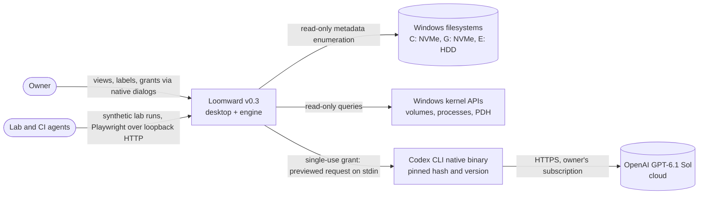
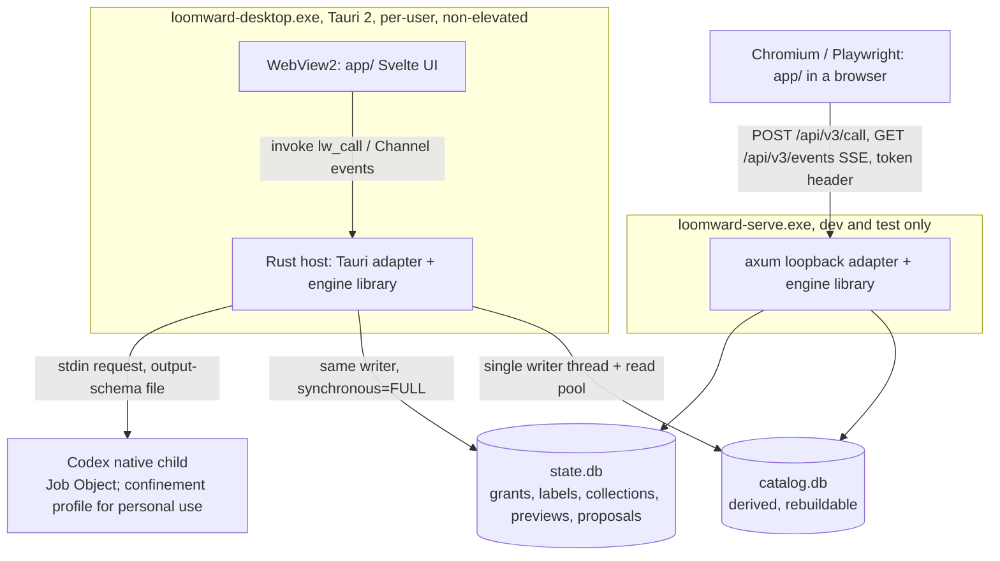
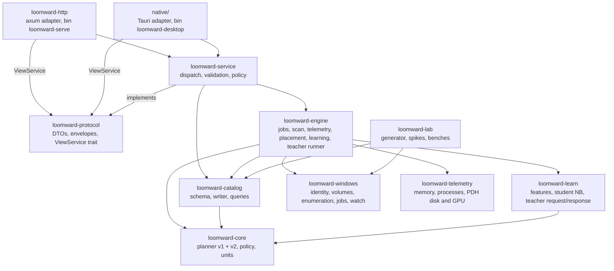
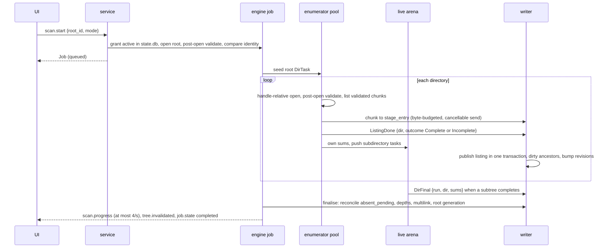
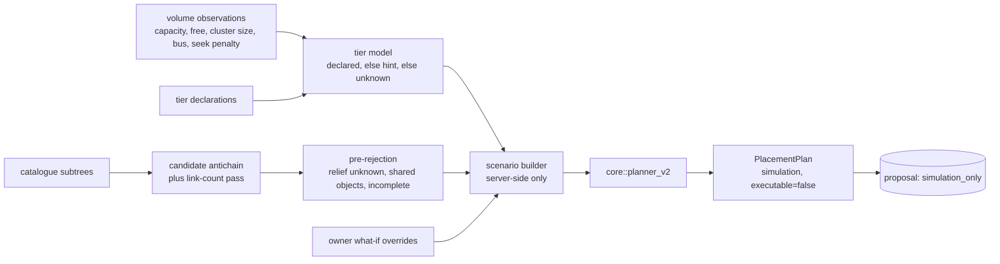

# Loomward v0.3 architecture: the "Woven" programme

Status: **proposed, revision 2** (2026-10-09, after the cross-vendor review on PR #110; disposition in section
20). Decisions are recorded in [42](42-v03-adrs.md); the parallel plan is [43](43-v03-lanes.md); the wire
contract is [`contracts/v3/`](../contracts/v3/), with normative protocol semantics in
[`contracts/v3/semantics.md`](../contracts/v3/semantics.md). This document is the contract other agents implement
against. Where it says "pending the spike", the named default holds until a measured result replaces it. Nothing
here changes the product invariants in `AGENTS.md`; v0.3 moves, deletes, kills, suspends, reprioritises and trims
nothing. Every balancing or resource output is a simulation or a proposal.

## 1. Frame

**Problem.** v0.2 is a tested Python reference with a generic browser UI and an uncompiled-until-today Rust
foundation. The owner wants all four pillars at once: (a) a native engine that inventories disks far faster than
WinDirStat with real identity, volume capabilities and a persistent catalogue, under a new signature UI; (b)
organisation and learning with a Rust-resident student and an optional GPT-6.1 Sol teacher; (c) storage
balancing simulated against the real C:, G: and E: volumes; (d) a read-only resource companion. Plus a lab for
synthetic, scale and stress testing.

**Forces.** One owner, many parallel agents (4 Sol, 2 Opus, 2 Sonnet, Haiku and Muse swarms), Windows 11 host,
public MIT repo, workers already building `loomward-windows`, `loomward-lab`, `loomward-telemetry` and
`app/prototype/`. Rust 1.97, Node 24, Python 3.14 measured. The UI must grow with the engine, so the contract
between them must be stable before either side is finished.

**Quality attributes, ranked.**

1. **Correctness and honesty** (invariants 4, 9): totals match the filesystem or say why not; unknown stays
   unknown; simulations are labelled; a quantity is never presented under a stronger name than its observation
   supports (entry bytes are not unique bytes; unique bytes are not reclaimable bytes).
2. **Security and privacy** (invariants 1, 2, 3, 5, 7): no effect surface, no silent reach, grants from native
   surfaces only, disclosure bounded, previewed and **enforced**, not merely requested.
3. **Performance**: scan throughput, bounded memory at 10M entries, interactive slices.
4. **Maintainability**: disjoint lanes, one owner per contract, cross-language oracles.
5. **Operability**: self-health, cancellation, recoverable state.
6. **Cost**: one process, no servers, no paid services beyond the owner's existing Codex subscription.

The two that drive this design are **correctness** and **performance at 10M entries**; security is a hard
constraint rather than a trade-off axis.

**Hard constraints.** Invariants 1-9; non-elevated operation; no automatic cloud requests; Python remains the
reference; v1 planner and its 51-case counterexample stay; `handoff/v1/` untouched; synthetic and personal
evidence never mix. **Preferences.** Svelte 5 for the shell; Canvas for heavy visuals; Rust for the engine.

## 2. Context (C4 level 1)



The only egress path is Loomward to Codex to OpenAI, and only through `teacher.run` with a single-use
disclosure grant (section 9). In v0.3 that path carries **synthetic data only** until the confinement profile in
section 9.2 is demonstrated (ADR-V3-10). Everything else stays on the machine.

## 3. Containers (C4 level 2)



| Container | Process | Owns | Must not own |
|---|---|---|---|
| Desktop shell | `loomward-desktop.exe` (Tauri 2), standard user | Native folder picker, disclosure confirmation dialog, window, IPC adapter | Any webview-supplied path; any effect command |
| Engine library | In-process inside the shell or `loomward-serve` | Scans, catalogue, jobs, telemetry sampling, learning, placement simulation | Elevation, file handles opened for content, process control of others |
| Browser adapter | `loomward-serve.exe`, loopback only, CLI-launched | HTTP + SSE transport for dev, Playwright, agents | Root grants except `--grant-root` (personal sessions) or registered lab roots (synthetic sessions); personal disclosure grants |
| `catalog.db` | SQLite file, `synchronous=NORMAL` | Volumes, observed roots, dir/file rows, aggregates, scan runs, revisions | Anything that cannot be rebuilt by rescanning, including any grant or consent |
| `state.db` | SQLite file, `synchronous=FULL` | **Root grants and revocations**, lab-root registrations, human feedback, teacher previews, grants, requests and labels, taxonomy, collections, object references, tier declarations, saved simulations | Filesystem observations |
| Teacher child | Pinned native Codex executable under a Job Object | One request, one response | Tools, MCP, user config, rules, network beyond the provider (enforced before personal use), a second request |

**The engine runs in-process** (ADR-V3-01). The service boundary is a Rust trait, so moving the engine into its
own process later (LW-017, named pipe) is an adapter change, not a redesign. Two instances on one dataset class
are prevented by an exclusive lock file in the state directory (`busy` error to the second).

**State directories.** `%LOCALAPPDATA%\Loomward\v3\<dataset_class>\{catalog.db, state.db, backups\, teacher\,
lock}` by default; `--state-dir` overrides (the lab uses `G:\loomward-lab\state\`). A root that contains, or is
contained by, the state directory is refused at grant time and the state directory is excluded by file identity
during scans. State is never committed (`*.db` is gitignored; `.loomward/` too).

## 4. Components (C4 level 3: inside the engine library)



Dependencies point one way: adapters to service to engine to leaves. Leaves (`core`, `learn`, `windows`,
`telemetry`) never depend on the engine. Win32 calls and `unsafe` live only in `loomward-windows` and
`loomward-telemetry`; every other crate keeps `#![forbid(unsafe_code)]`.

| Crate | Responsibility | Key modules | Must not |
|---|---|---|---|
| `loomward-core` (exists) | Pure domain: planner v1 (unchanged), planner v2 port (#107), capability policy, unit types | `planner.rs`, `planner_v2.rs`, `policy.rs`, `units.rs` | IO, threads, Win32 |
| `loomward-windows` (#108) | Read-only Win32: handle-derived identity, volumes and device hints, directory enumeration strategies, handle-relative opens, owned-child Job Objects, change watching | `identity.rs`, `volumes.rs`, `enumerate/`, `jobs.rs`, `watch.rs` | Any write, delete, rename, kill, suspend, priority or trim call on anything Loomward did not spawn; elevation |
| `loomward-telemetry` (#109) | Read-only memory, process, PDH disk and (wave 2) PDH GPU sampling with two-sample rates | per its PR | Any process mutation; summing per-process GPU memory into adapter totals |
| `loomward-lab` (in flight, W0-B) | Deterministic synthetic trees, lab-root registration, enumeration spike, benches, hostile-name corpus | `gen/`, `spike/`, `bench/` | Ship in the desktop app; touch paths outside its lab root |
| `loomward-catalog` | SQLite schema and migrations for both files, the single writer thread, read pool, revisions, staging, reconciliation, slice/children/search/breakdown queries, accounting | `schema/`, `writer.rs`, `reconcile.rs`, `read.rs`, `slice.rs`, `search.rs`, `accounting.rs`, `migrate.rs` | Enumerate the filesystem; know about HTTP or Tauri |
| `loomward-learn` | Feature extraction, weighted NB student (port), teacher request building, screening and strict response validation | `features.rs`, `student.rs`, `teacher_payload.rs`, `teacher_validate.rs` | Spawn processes; touch the network; read file contents |
| `loomward-engine` | Job manager, cancellation, scan pipeline, live arena, event bus, telemetry scheduler, placement scenario builder, learning jobs, teacher runner, own-pool budgets | `jobs/`, `scan/`, `events.rs`, `telemetry/`, `placement/`, `learning/`, `teacher/`, `budgets.rs` | Expose a generic command; accept paths from callers |
| `loomward-protocol` | Rust mirror of `contracts/v3`: envelopes, every DTO, bounds validation, `ViewService`, `EventStream` | `envelope.rs`, `dto/`, `service.rs` | Business logic |
| `loomward-service` | Implements `ViewService`: decode, validate, check grants, provenance and dataset class, call engine/catalog, map to DTOs, mint and verify opaque IDs, idempotency cache | `dispatch.rs`, `ids.rs`, `policy.rs`, `idempotency.rs`, `commands/` | Transport concerns |
| `loomward-http` | `loomward-serve` binary: loopback bind, token, Host/Origin checks, body limits, SSE with epochs, static `app/dist` | `main.rs`, `auth.rs`, `sse.rs` | Bind non-loopback; grant roots outside section 12's rules |
| `native/` | Tauri 2 shell: `lw_call`, `lw_events` Channel, native picker and confirmation dialogs | `src/main.rs`, `src/dialogs.rs` | Expose fs/shell/http/process plugins to the webview |

**Workspace.** `members = ["crates/*"]` (arrived with #108/#109); the coordinator pre-declares approved
dependencies in `[workspace.dependencies]` (ADR-V3-02). `native/` stays excluded from the root workspace and
depends on workspace crates by path. Every crate builds on ubuntu: Win32 code is `#[cfg(windows)]` with explicit
`Unsupported` stubs, and the engine carries a portable `std::fs::read_dir` source so scan tests run on both legs.

### 4.1 Enumeration seam: what the engine needs from `loomward-windows`

The engine owns this seam (`crates/loomward-engine/src/scan/source.rs`). If W0-A/W0-B ship different names, the
adapter goes in that file; the facts below are what must hold.

```rust
pub trait DirSource: Send + Sync {
    type Dir: Send;
    fn strategy(&self) -> EnumerationStrategy;
    /// Open the granted root (FILE_FLAG_OPEN_REPARSE_POINT), validate it post-open (below) and return identity.
    fn open_root(&self, root: &GrantedRoot) -> Result<(Self::Dir, OpenedIdentity), SourceError>;
    /// Stream every entry in validated buffer chunks. Never opens a file. Never reads content.
    fn list(&self, dir: &Self::Dir, sink: &mut dyn FnMut(RawEntry<'_>) -> Flow) -> ListOutcome;
    /// Open a child directory relative to its parent handle by exact UTF-16 name, then validate it post-open.
    fn open_child(&self, parent: &Self::Dir, entry: &RawEntry<'_>) -> Result<(Self::Dir, OpenedIdentity), SourceError>;
}
pub enum FileIdObs { Id128([u8; 16]), Id64(u64) }   // width preserved; a 64-bit ID is never padded to "128"
pub struct RawEntry<'a> {
    pub name: &'a [u16],                // exact UTF-16, may hold unpaired surrogates
    pub file_id: Option<FileIdObs>,
    pub attributes: u32,
    pub reparse_tag: Option<u32>,       // None when the strategy cannot report it
    pub end_of_file: u64,               // default stream, as listed
    pub allocation_size: Option<u64>,   // default stream, as listed
    pub creation: Option<i64>, pub last_write: Option<i64>, pub change: Option<i64>, pub last_access: Option<i64>,
}
pub enum Flow { Continue, Stop }
pub enum ListOutcome { Complete, Incomplete(IncompleteReason) } // Cancelled, AccessDenied, Io(code), Malformed, Limit
pub struct OpenedIdentity { pub id: Option<FileIdObs>, pub basis: IdBasis /* Listed | PostOpen | None */,
                            pub attributes: u32, pub reparse_tag: Option<u32> }
```

**Strategy chain, per volume capability** (pending the LW-101 spike's measurement; default first):

| Order | Strategy | ID | Reparse tag | Allocation, change time | Used when |
|---|---|---|---|---|---|
| 1 (default) | `GetFileInformationByHandleEx(FileIdExtdDirectoryInfo)`; the spike may substitute `NtQueryDirectoryFileEx(FileIdExtdDirectoryInformation)` with the same record if measurably faster | 128-bit | Yes | Yes | Volume supports extended IDs (NTFS, ReFS) |
| 2 | `GetFileInformationByHandleEx(FileIdBothDirectoryInfo)` | 64-bit (`native_file_id_64`) | No (reparse entries are still recognised by attribute and never traversed; tag recorded `null`) | Yes | Extended class unsupported but 64-bit IDs are |
| 3 | `FindFirstFileExW(FindExInfoBasic, FIND_FIRST_EX_LARGE_FETCH)` on a handle-validated directory | None | From `dwReserved0` when the reparse attribute is set | Allocation and change time unknown (`null`) | No ID-bearing class (FAT32, exFAT, some network/virtual) |
| CI only | `std::fs::read_dir` | None | No | Unknown | Non-Windows builds |

**Child opens are handle-relative**: `NtCreateFile` with `RootDirectory` = the parent's open handle and the exact
listed UTF-16 name, `FILE_DIRECTORY_FILE | FILE_OPEN_REPARSE_POINT | FILE_SYNCHRONOUS_IO_NONALERT`, access
`FILE_LIST_DIRECTORY | FILE_READ_ATTRIBUTES | SYNCHRONIZE`, share all. A reconstructed absolute path is not an
equivalent check. (`windows-sys` `Wdk` feature; ntdll is documented in the WDK.)

**Post-open validation, before any listing** (root and every child): read `FileAttributeTagInfo`; refuse to list
if the handle is a reparse point, or carries `OFFLINE`, `RECALL_ON_OPEN` or `RECALL_ON_DATA_ACCESS` (Microsoft
documents that enumerating a `RECALL_ON_DATA_ACCESS` directory may fetch remote content). Read `FileIdInfo` where
supported. Identity policy:

- Listed ID and post-open ID both present: they must match, else `IdentityChanged` (directory recorded `partial`
  with `enumeration_error`; scan continues).
- Listed ID absent, post-open ID present: the post-open ID becomes the row's identity with basis `post_open`.
- Neither present: traversal proceeds with identity quality `path_observation`; such rows cannot carry durable
  references (section 6.3) and refresh matches them by name only.

**No-hydration guarantee, scoped.** Enumeration never opens files and never lists a directory that fails
post-open validation. With strategy `nt_query_directory_file_ex` the engine passes
`FILE_QUERY_ON_DISK_ENTRIES_ONLY` and records `on_disk_only_listing` with partial coverage. The guarantee is
**tested** for local NTFS and for Cloud Files (OneDrive) placeholders in the fixture lab. Other virtualization
providers (ProjFS and third-party filter drivers) are unverified: a root on a volume or path where one is detected
is refused at grant time, and any directory whose post-open attributes are unexpected is excluded, not listed.
`OPEN_REPARSE_POINT` is not claimed as a general no-network guarantee.

**Buffer semantics** (all strategies): validate each record's `NextEntryOffset` (8-byte aligned, inside the
buffer), `FileNameLength` (even, inside the record) before reading; a zero `NextEntryOffset` ends the **buffer**,
not the directory; end of directory is only `ERROR_NO_MORE_FILES` / `STATUS_NO_MORE_FILES`; a success with zero
bytes means "buffer too small": grow up to 1 MiB, then `Incomplete(Malformed)`. Any malformed record makes the
listing `Incomplete`.

From LW-003 (`identity.rs`) and LW-004 (`volumes.rs`): `ObservedIdentity { volume_serial: u64, id: FileIdObs,
quality }`, and `VolumeObservation` with GUID path, mount points, filesystem name, label, 64-bit serial, capacity,
caller-visible free bytes, **bytes per cluster**, `FILE_SUPPORTS_*` flags, online/read-only/removable and
`DeviceHint { bus_type, seek_penalty, disk_numbers }`. The volume key is serial plus GUID path, never a drive
letter. **Identity is an observation, not a grant**: no function accepts an identity and returns a capability.

Raw MFT reads and `FSCTL_ENUM_USN_DATA` are out: both need an elevated volume handle (invariant 2) and doc 04
forbids an MFT parser without a malformed-record corpus (ADR-V3-05).

## 5. The view-model service contract

Machine-readable: [`view-service.schema.json`](../contracts/v3/view-service.schema.json) (every payload as
`$defs`), [`commands.json`](../contracts/v3/commands.json) (command to request/result binding, adapters, wave,
events) and the normative [`semantics.md`](../contracts/v3/semantics.md) (ingress order, deadlines, which
timed-out mutations may have committed, idempotency, revision scopes, commit-before-event, epochs and replay).

### 5.1 Envelope and transports

```json
{"protocol":"loomward/3","request_id":"r_000017","command":"tree.slice","payload":{...},"deadline_ms":2000}
{"protocol":"loomward/3","request_id":"r_000017","ok":true,"result":{...},"meta":{"served_at":"2026-10-09T12:00:00.000Z","elapsed_ms":14,"dataset_class":"synthetic","budget_hit":false,"catalog_rev":"8812"}}
{"protocol":"loomward/3","request_id":"r_000017","ok":false,"error":{"code":"stale_generation","message":"...","retryable":true,"detail":null}}
{"protocol":"loomward/3","epoch":"e_k3J9x2Qa","seq":4211,"event":"scan.progress","at":"2026-10-09T12:00:00.250Z","catalog_rev":"8813","data":{...}}
```

| | Desktop (Tauri 2) | Browser (`loomward-serve`) |
|---|---|---|
| Call | `invoke('lw_call', { request })` returns the response envelope | `POST /api/v3/call`, JSON body at most 64 KiB, header `X-Loomward-Token`, always HTTP 200 with an envelope; 400/403/413/415 only for transport faults |
| Events | `invoke('lw_events', { channel, lastEpoch, lastSeq })`, a Tauri `Channel<EventEnvelope>` | `GET /api/v3/events`, SSE `id: <epoch>.<seq>`, token header, optional `Last-Event-ID`; read with `fetch` streaming, not `EventSource` |
| Auth | In-process IPC; no token | 256-bit random token printed once as `http://127.0.0.1:PORT/#token=...`; constant-time compare |
| Grants | Native folder picker (personal sessions) or registered lab roots (synthetic); native disclosure confirmation | Roots from `--grant-root` (section 12 rules); personal disclosure refused |

**Numbers (ADR-V3-04).** Byte quantities are decimal strings in `0..=u64::MAX` (runtime-checked); `null` means
unknown. Bounded counts are JSON integers. Timestamps are UTC with a literal `Z`. IDs are opaque prefixed strings.
No command accepts a path string; `DisplayPath` is output-only.

**Bounds.** Request 64 KiB; slice at most 6,000 nodes (default 2,500); pages at most 200 items; search at most
100; teacher batches at most 25 items; event queue 1,024 per subscriber. Long work returns a `Job`.

### 5.2 Commands

All 45 commands have `effects: none`. Bold rows exist only on the desktop adapter.

| Area | Command | Request | Result | Notes |
|---|---|---|---|---|
| Session | `session.hello` | `EmptyRequest` | `SessionInfo` | Protocol, adapter, dataset class, strategy, capability matrix with every effect `false`, limits |
| | `health.get` | `EmptyRequest` | `Health` | Engine memory/CPU, catalogue size, writer queue, warnings |
| Roots | `roots.list` | `EmptyRequest` | `RootList` | |
| | **`roots.request_grant`** | `RootGrantRequest` | `RootGrantResult` | Personal sessions only; synthetic sessions refuse with `synthetic_session_requires_lab_root` |
| | `roots.revoke` | `RootRevokeRequest` | `RootRevokeResult` | Cancels observation of the root first; `purge_catalog` deletes Loomward's rows only |
| Volumes | `volumes.list` | `EmptyRequest` | `VolumeList` | Device hints are hints, not speeds |
| | `volumes.declare_tier` | `DeclareTierRequest` | `DeclareTierResult` | Human preference (append-only) |
| Scan | `scan.start` | `ScanStartRequest` | `JobResult` | `full` or `refresh`; optional budget |
| | `scan.cancel` | `JobRefRequest` | `JobResult` | Acknowledged at once as `cancel_requested` |
| | `jobs.get` / `jobs.list` | `JobRefRequest` / `JobListRequest` | `JobResult` / `JobList` | |
| Tree | `tree.slice` | `TreeSliceRequest` | `TreeSlice` | Bounded tree; `aggregate_state` says consistent or provisional (section 8) |
| | `tree.children` | `TreeChildrenRequest` | `EntryPage` | Keyset paging by size; name/modified sorts limited to 10,000 children |
| | `tree.path` | `NodeRefRequest` | `NodePath` | Breadcrumb |
| | `node.inspect` | `NodeRefRequest` | `NodeDetail` | Identity observation with `durable_reference` and `authorises_effects: false` |
| | `threads.meaning` | `MeaningRequest` | `MeaningResult` | Lazy meaning thread (wave 3) |
| | `search.query` | `SearchRequest` | `EntryPage` | Bounded; `budget_hit` with a resumable cursor |
| | `stats.breakdown` | `BreakdownRequest` | `Breakdown` | By extension family, extension or age band |
| Learning | `taxonomy.get`, `feedback.record`, `learning.status`, `learning.queue`, `learning.refit` | | | Human data class only for feedback; `client_event_id` idempotent |
| | `collections.list` / `.create` / `.update_members` / `.members` | | | Virtual membership via durable object references |
| Teacher | `teacher.preview` | `TeacherPreviewRequest` | `TeacherPreview` | Immutable complete request with digests; sends nothing |
| | `grants.create_disclosure` | `DisclosureGrantRequest` | `DisclosureGrantResult` | Personal: `confinement_not_enforced` until section 9.2 holds; then native dialog showing every item |
| | `grants.list` / `grants.revoke` | | `GrantList` / `GrantRevokeResult` | Root and disclosure grants, all from `state.db` |
| | `teacher.run` | `TeacherRunRequest` | `JobResult` | The only egress; grant consumed before spawn; replay returns the same job |
| | `teacher.results` | `JobRefRequest` | `TeacherResults` | `data_class: teacher`, weight 0.2, `requires_review: true` |
| Placement | `tiers.model`, `placement.candidates`, `placement.simulate`, `proposals.list`, `proposals.get` | | | Simulation only; `pre_rejected`, `excluded_volumes`, relief basis (section 10) |
| Companion | `telemetry.subscribe` / `.unsubscribe` / `.snapshot`, `processes.list` / `.explain`, `budgets.get` / `.set` | | | Leases; read-only; own pools only |

**Events.** `stream.hello`, `stream.lagged`, `job.state`, `scan.progress` (at most 4/s per job),
`tree.invalidated` (at most 2/s per root), `telemetry.sample`, `learning.updated`, `roots.changed`,
`volumes.changed`, `health.warning`. Bindings in `commands.json`; ordering and replay in `semantics.md`.

**Contract tests that must exist** (lane L1): every example validates as a **complete envelope**, with payloads
discriminated by `command`/`event` through `commands.json` (an `EventEnvelope` whose `job.state` data is not a
`JobResult` must fail); `date-time` format validation enabled; byte strings above `u64::MAX` rejected at runtime;
every example round-trips through its Rust DTO; no command name matches the forbidden pattern; every
`Capabilities.effects` member is `const false`; the HTTP adapter returns `capability_unavailable` for
`roots.request_grant`.

### 5.3 The service trait and its stream

```rust
// crates/loomward-protocol/src/service.rs
pub trait ViewService: Send + Sync + 'static {
    /// Synchronous; long work returns a Job. Deadlines per semantics.md section 2.
    fn call(&self, request: RequestEnvelope, ctx: &CallContext) -> ResponseEnvelope;
    /// Opens a stream. `resume` = (epoch, last applied seq) from the client, if any.
    fn subscribe(&self, resume: Option<(String, u64)>) -> Box<dyn EventStream>;
}
pub trait EventStream: Send {
    fn epoch(&self) -> &str;
    /// Blocks up to `timeout`. The first item is always stream.hello; replay or stream.lagged follow per
    /// semantics.md section 7. Never blocks the engine: the queue behind it is bounded (1,024).
    fn recv_timeout(&mut self, timeout: std::time::Duration) -> RecvOutcome;
    /// Idempotent; releases the subscriber slot. Adapters call it on client disconnect or window close.
    fn close(&mut self);
}
pub enum RecvOutcome { Event(EventEnvelope), Timeout, Closed(CloseReason) }
pub enum CloseReason { ServiceShutdown, ClosedByAdapter, TooManyStreams }
pub struct CallContext { pub adapter: Adapter, pub dialogs: Option<std::sync::Arc<dyn NativeDialogs>> }
pub enum Adapter { Tauri, Http }
pub trait NativeDialogs: Send + Sync {
    /// Rust-side folder picker; the chosen path never crosses IPC.
    fn pick_folder(&self) -> Option<std::path::PathBuf>;
    /// Native modal listing recipient, model, fields and every item of the summary. True only on explicit accept.
    fn confirm_disclosure(&self, summary: &DisclosureSummary) -> bool;
}
```

`DisclosureSummary` is the `$defs/DisclosureSummary` DTO, built by Rust from the stored immutable preview, never
from UI input. Adapters run `call` on a blocking pool and pump the `EventStream` into the SSE response or the
Tauri `Channel`; both call `close` on disconnect. The stream itself yields a repeated `stream.hello` after 15 s
without other events, so both transports carry the same heartbeat (the app treats 45 s of silence as
unavailable; `semantics.md` section 7).

## 6. Persistent stores (schema v3, migration 1)

### 6.1 Files, durability and recovery (ADR-V3-06, ADR-V3-22)

Two SQLite files per dataset class, `rusqlite` with bundled SQLite, `STRICT` tables, WAL, `foreign_keys=ON`,
`application_id = 0x4C4D5752` ("LMWR"), `user_version` = migration number. The writer thread opens `catalog.db`
as `main` and attaches `state.db` as `st`, and sets **`main.synchronous=NORMAL`** (derived data) and
**`st.synchronous=FULL`** (precious state) on that connection. **No transaction spans both files**, and no
correctness property depends on a two-file WAL commit: an operation that needs both writes `state.db` first in
its own transaction (for example a grant), then `catalog.db` derived rows that can be rebuilt.

Open refuses a foreign `application_id`, a newer `user_version`, a `meta.dataset_class` different from the
session's class, or a network path. `PRAGMA quick_check` runs at open. A corrupt `catalog.db` is renamed aside and
rebuilt by rescanning the **active grants in `state.db`**; catalogue recovery never creates, reactivates or alters
a grant. `state.db` is backed up with `VACUUM INTO` at every start (keeping 7) and before each migration; a corrupt
`state.db` refuses that dataset class until the owner restores a backup.

Wire values are decimal strings; storage is `INTEGER` (signed 64-bit; observed sizes above 2^63-1 are rejected
as invalid observations, which no NTFS file reaches). Timestamps are FILETIME ticks (`*_ft`), `NULL` when the
strategy cannot observe them. All row tables use `INTEGER PRIMARY KEY AUTOINCREMENT`, so row IDs are never
reused (SQLite reuses the largest deleted row ID otherwise).

### 6.2 DDL

```sql
-- catalog.db: derived, rebuildable.
CREATE TABLE meta (key TEXT PRIMARY KEY, value TEXT NOT NULL) STRICT;   -- dataset_class, instance_id, engine_version
CREATE TABLE revision (id INTEGER PRIMARY KEY CHECK (id = 1), catalog_rev INTEGER NOT NULL) STRICT;
CREATE TABLE volume (
  id INTEGER PRIMARY KEY AUTOINCREMENT, volume_key TEXT NOT NULL UNIQUE, display_name TEXT NOT NULL,
  filesystem TEXT, bytes_per_cluster INTEGER, identity_json TEXT NOT NULL, capabilities_json TEXT NOT NULL,
  device_json TEXT NOT NULL, online INTEGER NOT NULL CHECK (online IN (0,1)), observed_at_ns INTEGER NOT NULL) STRICT;
CREATE TABLE root (                       -- observation of a grant's root; the grant itself lives in state.db
  id INTEGER PRIMARY KEY AUTOINCREMENT, grant_id INTEGER NOT NULL UNIQUE,   -- st.root_grant.id (no cross-file FK)
  volume_id INTEGER REFERENCES volume(id), root_file_id BLOB CHECK (root_file_id IS NULL OR length(root_file_id) IN (8,16)),
  generation INTEGER, active_run INTEGER, state TEXT NOT NULL
    CHECK (state IN ('never_scanned','scanning','complete','partial','stale','repairing','failed'))) STRICT;
CREATE TABLE scan_run (
  id INTEGER PRIMARY KEY AUTOINCREMENT, root_id INTEGER NOT NULL REFERENCES root(id) ON DELETE CASCADE,
  mode TEXT NOT NULL CHECK (mode IN ('full','refresh','targeted')), strategy TEXT NOT NULL,
  state TEXT NOT NULL CHECK (state IN ('running','cancelled','failed','completed')),
  started_at_ns INTEGER NOT NULL, finished_at_ns INTEGER,
  counters_json TEXT NOT NULL, budget_json TEXT NOT NULL, error_json TEXT) STRICT;
CREATE TABLE ext (id INTEGER PRIMARY KEY, ext TEXT NOT NULL UNIQUE, family TEXT NOT NULL) STRICT;
CREATE TABLE dir (
  id INTEGER PRIMARY KEY AUTOINCREMENT, root_id INTEGER NOT NULL REFERENCES root(id) ON DELETE CASCADE,
  parent_id INTEGER REFERENCES dir(id) ON DELETE CASCADE,          -- NULL only for the root directory
  name TEXT NOT NULL, name_utf16 BLOB,                             -- raw UTF-16LE only when lossy
  file_id BLOB CHECK (file_id IS NULL OR length(file_id) IN (8,16)),
  id_quality TEXT NOT NULL CHECK (id_quality IN ('native_file_id_128','native_file_id_64','path_observation')),
  id_basis TEXT NOT NULL CHECK (id_basis IN ('listed','post_open','none')),
  depth INTEGER NOT NULL, attrs INTEGER NOT NULL, reparse_tag INTEGER, flags INTEGER NOT NULL DEFAULT 0,
  created_ft INTEGER, modified_ft INTEGER, changed_ft INTEGER,
  listing_state TEXT NOT NULL CHECK (listing_state IN
    ('complete','incomplete','unlisted','excluded','denied','absent_pending')),
  born_run INTEGER NOT NULL, seen_run INTEGER NOT NULL,
  listing_rev INTEGER NOT NULL DEFAULT 0, subtree_rev INTEGER NOT NULL DEFAULT 0,
  dirty_rev INTEGER NOT NULL DEFAULT 0, dirty_run INTEGER, agg_valid_rev INTEGER NOT NULL DEFAULT 0,
  own_files INTEGER NOT NULL DEFAULT 0, own_logical INTEGER NOT NULL DEFAULT 0,
  own_allocated INTEGER NOT NULL DEFAULT 0, own_alloc_unknown INTEGER NOT NULL DEFAULT 0,
  own_noid INTEGER NOT NULL DEFAULT 0, own_skipped INTEGER NOT NULL DEFAULT 0, own_errors INTEGER NOT NULL DEFAULT 0,
  sub_files INTEGER NOT NULL DEFAULT 0, sub_dirs INTEGER NOT NULL DEFAULT 0,
  sub_logical INTEGER NOT NULL DEFAULT 0, sub_allocated INTEGER NOT NULL DEFAULT 0,
  sub_alloc_unknown INTEGER NOT NULL DEFAULT 0, sub_noid INTEGER NOT NULL DEFAULT 0,
  sub_skipped INTEGER NOT NULL DEFAULT 0, sub_errors INTEGER NOT NULL DEFAULT 0, sub_newest_ft INTEGER,
  sub_complete INTEGER NOT NULL DEFAULT 0 CHECK (sub_complete IN (0,1))) STRICT;
CREATE INDEX dir_by_logical   ON dir(parent_id, sub_logical DESC, id);
CREATE INDEX dir_by_allocated ON dir(parent_id, sub_allocated DESC, id);
CREATE UNIQUE INDEX dir_identity ON dir(root_id, file_id) WHERE file_id IS NOT NULL;
CREATE TABLE file (
  id INTEGER PRIMARY KEY AUTOINCREMENT, dir_id INTEGER NOT NULL REFERENCES dir(id) ON DELETE CASCADE,
  name TEXT NOT NULL, name_utf16 BLOB, ext_id INTEGER REFERENCES ext(id),
  file_id BLOB CHECK (file_id IS NULL OR length(file_id) IN (8,16)),
  logical INTEGER NOT NULL, allocated INTEGER,                      -- default stream; NULL allocated = unknown
  created_ft INTEGER, modified_ft INTEGER, changed_ft INTEGER, accessed_ft INTEGER,
  attrs INTEGER NOT NULL, reparse_tag INTEGER, flags INTEGER NOT NULL DEFAULT 0,
  link_count INTEGER,                                               -- NULL until an accounting pass observes it
  born_run INTEGER NOT NULL, seen_run INTEGER NOT NULL) STRICT;
CREATE INDEX file_by_logical   ON file(dir_id, logical DESC, id);
CREATE INDEX file_by_allocated ON file(dir_id, allocated DESC, id);  -- NULLs sort last under DESC
CREATE INDEX file_identity     ON file(file_id) WHERE file_id IS NOT NULL;
CREATE INDEX file_by_ext       ON file(ext_id, logical DESC);        -- first index to drop if P14 fails
CREATE TABLE multilink (                  -- objects with more than one observed name, rebuilt at finalise
  volume_id INTEGER NOT NULL, file_id BLOB NOT NULL, names INTEGER NOT NULL, allocated INTEGER,
  PRIMARY KEY (volume_id, file_id)) STRICT;
CREATE TABLE stage_entry (                -- chunks of large or in-progress listings, published atomically
  run_id INTEGER NOT NULL, dir_id INTEGER NOT NULL, seq INTEGER NOT NULL, entries BLOB NOT NULL,
  PRIMARY KEY (run_id, dir_id, seq)) STRICT;

-- state.db: precious, synchronous=FULL, attached as `st`.
CREATE TABLE meta (key TEXT PRIMARY KEY, value TEXT NOT NULL) STRICT;   -- dataset_class, instance_id
CREATE TABLE root_grant (
  id INTEGER PRIMARY KEY AUTOINCREMENT, volume_key TEXT NOT NULL,
  root_file_id BLOB NOT NULL CHECK (length(root_file_id) IN (8,16)), display_path TEXT NOT NULL,
  origin TEXT NOT NULL CHECK (origin IN ('fixture','lab_generated','owner_granted')),
  granted_via TEXT NOT NULL CHECK (granted_via IN ('desktop_picker','cli_flag','fixture')),
  lab_root_id INTEGER REFERENCES lab_root(id),                    -- required when origin = 'lab_generated'
  state TEXT NOT NULL CHECK (state IN ('active','revoked','identity_changed')),
  granted_at_ns INTEGER NOT NULL, revoked_at_ns INTEGER) STRICT;
CREATE TABLE lab_root (                   -- synthetic state.db only; written by `loomward-lab generate --register`
  id INTEGER PRIMARY KEY AUTOINCREMENT, volume_key TEXT NOT NULL, root_file_id BLOB NOT NULL,
  manifest_digest TEXT NOT NULL, seed TEXT NOT NULL, tier TEXT NOT NULL, registered_at_ns INTEGER NOT NULL,
  UNIQUE (volume_key, root_file_id)) STRICT;
CREATE TABLE object_ref (                 -- durable reference, continuity-keyed (section 6.3)
  id INTEGER PRIMARY KEY AUTOINCREMENT, volume_key TEXT NOT NULL,
  file_id BLOB NOT NULL CHECK (length(file_id) IN (8,16)), creation_ft INTEGER NOT NULL,
  kind TEXT NOT NULL CHECK (kind IN ('file','dir')),
  state TEXT NOT NULL CHECK (state IN ('resolved','unresolved')), last_resolved_ns INTEGER,
  UNIQUE (volume_key, file_id, creation_ft)) STRICT;
CREATE TABLE taxonomy (version INTEGER PRIMARY KEY, labels_json TEXT NOT NULL, created_at_ns INTEGER NOT NULL) STRICT;
CREATE TABLE human_feedback (
  id INTEGER PRIMARY KEY AUTOINCREMENT, event_id TEXT NOT NULL UNIQUE, client_event_id TEXT NOT NULL UNIQUE,
  content_digest TEXT NOT NULL, object_ref_id INTEGER NOT NULL REFERENCES object_ref(id),
  revision INTEGER NOT NULL CHECK (revision > 0),
  label TEXT NOT NULL,                    -- for a retraction: the label being withdrawn
  retracted INTEGER NOT NULL CHECK (retracted IN (0,1)),
  taxonomy_version INTEGER NOT NULL REFERENCES taxonomy(version), features_json TEXT NOT NULL,
  recorded_at_ns INTEGER NOT NULL, UNIQUE (object_ref_id, revision)) STRICT;
CREATE TABLE teacher_preview (            -- immutable once written
  id INTEGER PRIMARY KEY AUTOINCREMENT, preview_key TEXT NOT NULL UNIQUE, request_json TEXT NOT NULL,
  serialization_version TEXT NOT NULL, payload_digest TEXT NOT NULL, runner_profile_digest TEXT NOT NULL,
  handle_map_json TEXT NOT NULL, created_at_ns INTEGER NOT NULL, expires_at_ns INTEGER NOT NULL) STRICT;
CREATE TABLE disclosure_grant (
  id INTEGER PRIMARY KEY AUTOINCREMENT, preview_id INTEGER NOT NULL UNIQUE REFERENCES teacher_preview(id),
  recipient TEXT NOT NULL, payload_digest TEXT NOT NULL, runner_profile_digest TEXT NOT NULL,
  confirmed_via TEXT NOT NULL CHECK (confirmed_via IN ('desktop_dialog','synthetic_policy')),
  created_at_ns INTEGER NOT NULL, expires_at_ns INTEGER NOT NULL, revoked_at_ns INTEGER, consumed_at_ns INTEGER) STRICT;
CREATE TABLE teacher_request (            -- created in the same transaction that consumes the grant
  id INTEGER PRIMARY KEY AUTOINCREMENT, grant_id INTEGER NOT NULL UNIQUE REFERENCES disclosure_grant(id),
  state TEXT NOT NULL CHECK (state IN ('consumed','running','completed','rejected','failed','interrupted')),
  started_at_ns INTEGER, finished_at_ns INTEGER, response_digest TEXT, rejection TEXT) STRICT;
CREATE TABLE teacher_label (              -- never human feedback
  id INTEGER PRIMARY KEY AUTOINCREMENT, event_id TEXT NOT NULL UNIQUE,   -- 'tl_<request>_<handle>'
  request_id INTEGER NOT NULL REFERENCES teacher_request(id),
  object_ref_id INTEGER NOT NULL REFERENCES object_ref(id), revision INTEGER NOT NULL CHECK (revision > 0),
  label TEXT, abstain INTEGER NOT NULL, reason TEXT NOT NULL, evidence_json TEXT NOT NULL,
  taxonomy_version INTEGER NOT NULL, features_json TEXT NOT NULL, received_at_ns INTEGER NOT NULL,
  UNIQUE (object_ref_id, revision)) STRICT;
CREATE TABLE student_model (
  id TEXT PRIMARY KEY, algorithm TEXT NOT NULL, taxonomy_version INTEGER NOT NULL, dataset_digest TEXT NOT NULL,
  training_count INTEGER NOT NULL, state_json TEXT NOT NULL,
  status TEXT NOT NULL CHECK (status IN ('candidate','active','retired')), fitted_at_ns INTEGER NOT NULL) STRICT;
CREATE TABLE collection (
  id INTEGER PRIMARY KEY AUTOINCREMENT, name TEXT NOT NULL UNIQUE,
  kind TEXT NOT NULL CHECK (kind IN ('human','label_view')), created_at_ns INTEGER NOT NULL) STRICT;
CREATE TABLE collection_member (
  collection_id INTEGER NOT NULL REFERENCES collection(id) ON DELETE CASCADE,
  object_ref_id INTEGER NOT NULL REFERENCES object_ref(id), added_at_ns INTEGER NOT NULL,
  PRIMARY KEY (collection_id, object_ref_id)) STRICT;
CREATE TABLE tier_declaration (
  id INTEGER PRIMARY KEY AUTOINCREMENT, volume_key TEXT NOT NULL, tier INTEGER CHECK (tier BETWEEN 0 AND 9),
  declared_at_ns INTEGER NOT NULL) STRICT;
CREATE TABLE proposal (
  id INTEGER PRIMARY KEY AUTOINCREMENT, kind TEXT NOT NULL CHECK (kind = 'placement_simulation'),
  status TEXT NOT NULL CHECK (status IN ('simulation_only','stale')),
  inputs_digest TEXT NOT NULL, inputs_json TEXT NOT NULL, plan_json TEXT NOT NULL, created_at_ns INTEGER NOT NULL) STRICT;
```

### 6.3 Identity rules

- **Node IDs.** `NodeId` = base64url of `(kind, row_id, born_run, catalogue instance)` plus an HMAC tag over those
  fields and the session key. The service verifies the tag and that the row still exists with the same
  `born_run`. Because row IDs are never reused and a row is never kept when its native object changes (below), a
  node ID cannot silently identify a different file. Stale IDs are `not_found`.
- **A location row never outlives its object.** A listing that shows the same name with a different file ID
  inserts a new row (new `born_run`); the old row is removed (files) or becomes `absent_pending` (directories).
- **Durable references** (labels, collection membership) are allowed only when the object has a native ID
  (128- or 64-bit, width kept), was observed on NTFS or ReFS, and has an observed creation time. The continuity
  key is `(volume_key, file_id, creation_ft)`. A later observation with the same key resolves the reference; the
  same `(volume_key, file_id)` with a different creation time is a **different object**: the old reference becomes
  `unresolved` and is never reattached automatically. After a catalogue rebuild or a volume reformat (new
  `volume_key`), references stay `unresolved` until their exact key is observed again. There is no path-based
  reattachment; unresolved labels are counted in the review desk for explicit owner reconciliation (later wave).
  Objects without a durable reference report `durable_reference: unavailable_*`, and `feedback.record` /
  `collections.update_members` on them return `capability_unavailable`.

### 6.4 What changed from `docs/catalogue-v2.sql`, and why

| v2 design | v3 | Reason |
|---|---|---|
| One database | `catalog.db` (derived) + `state.db` (precious), one pair per dataset class | Different recoverability; synthetic and personal never share a file |
| `scope` | `root_grant` in `state.db` with handle-derived root identity; `root` in `catalog.db` observes it | A grant is consent; it cannot live in a rebuildable file |
| `object` + `location` (path bytes) | `dir`/`file` rows (name + parent) and continuity-keyed `object_ref` | Row size at 10M; durable references survive moves but not object replacement |
| `object.generation` discriminator | `born_run` on rows; `creation_ft` in the continuity key | Restores the discriminator v2 had |
| IDs and timestamps as `TEXT` | `INTEGER` (AUTOINCREMENT ids), decimal strings on the wire | Row size; no row-ID reuse |
| `feedback` with a `provenance` check | `human_feedback` and `teacher_label`, each with event IDs and unique `(object, revision)` | Data classes physically separate; revision ordering for parity |
| `feature` table | Feature snapshot stored with each label | Reproducible refits |
| `approval`, `operation`, `backup_evidence` | Not created | No effects in v0.3 |
| `index_checkpoint`, `usage_observation` | Not created | Return with LW-007 and LW-028 |
| `proposal` with manifest digest | Simulation inputs and plan only | A simulation has nothing to approve |

## 7. Scan pipeline



1. **Admission.** The grant must be `active` in `state.db` and its provenance valid for the session (section 12).
   The root is opened and post-open validated; its volume key and ID must equal the grant's. Mismatch:
   `permission_denied` (`root_identity_changed`), grant state `identity_changed`, nothing scanned. One active
   run per root.
2. **Parallel enumeration.** A pool of `threads` workers (default 8 when the hint says no seek penalty, 2 when
   `seek_penalty = true`, 4 when unknown) shares directory tasks through `crossbeam-deque` (LIFO local, FIFO
   steal). Workers check the cancel token per directory and per chunk.
3. **Classification, never content.** No file handle is opened during a scan. Reparse points are recorded with
   `reparse_not_followed`. Placeholder attributes are recorded as `cloud_placeholder` and never opened.
   Sensitive names are flagged and counted. The state directory and `.loomward` are excluded by identity.
   Access-denied directories become `denied`.
4. **Chunks and staging.** Entries are converted into compact chunks (at most 16,384 entries) and sent to the
   writer, which appends them to `stage_entry` in small transactions. In-flight chunk memory across all
   producers and the writer queue is bounded by one **byte semaphore** (default 64 MiB); a producer that cannot
   acquire budget waits. Every send and every wait `select`s on the cancel token and the writer-failure signal,
   so a dead or full writer never strands a producer.
5. **Publication.** On `ListingDone`, the writer publishes the directory in **one transaction**, whatever its
   size: staged entries become `file`/`dir` rows; own totals update; the directory and every ancestor get
   `subtree_rev = dirty_rev = catalog_rev` and `dirty_run = run` (a depth-bounded walk); `listing_rev` increments
   if membership changed. Readers never see half a directory.
   - **Complete listing**: files absent from it are deleted; files whose name now carries a different file ID
     are replaced by a new row; child directories absent from it become `absent_pending` (hidden from reads, not
     deleted, because they may have moved).
   - **Incomplete listing** (cancelled, denied, failed, malformed, over the 2M-entry limit): staged entries are
     upserted, **nothing is deleted or marked absent**; the directory is `incomplete` with `listing_incomplete`;
     children not seen this run keep `seen_run < run` and are reported stale. A partial listing never establishes
     absence.
6. **Identity-first reconciliation of directories.** A child directory is matched by `(root_id, file_id)` before
   name. A known identity under a new parent is **reparented** (parent changed, `absent_pending` cleared, depth
   fixed at finalise), which handles `A/x → B/x` in either listing order without a uniqueness conflict. A name
   match with a different identity is a new row. Directories without IDs match by name only.
7. **Live arena.** Each discovered directory has a 40-byte slot (`parent: u32`, `pending: AtomicU32`, four
   `AtomicU64` sums). Own sums are added up the ancestor chain when a listing finishes; pending reaching zero
   sends `DirFinal { run, dir, sums }`. The writer applies a `DirFinal` only if `run` is the root's active run and
   `dir.dirty_run == run`; it then sets the subtree sums and `agg_valid_rev = catalog_rev`. Sums are
   **consistent** iff `agg_valid_rev >= dirty_rev`.
8. **Finalise.**
   - **Completed run** (every listing in the root `Complete`): delete `absent_pending` directories (cascade),
     recompute depths of reparented subtrees, rebuild `multilink` from `file_identity`, publish the root
     `generation`, checkpoint the WAL, emit `tree.invalidated` scope `all`.
   - **Cancelled, failed or with incomplete listings**: no absence is finalised; `absent_pending` directories
     stay hidden tombstones until a later completed run resolves them; a writer-run **repair rollup** recomputes
     inconsistent subtree sums bottom-up from own sums (`sub_complete = 0`); root coverage `partial`/`cancelled`.
   - The generation is a set of per-directory observations taken during the run window, not a point-in-time
     snapshot; changes during the run are caught by later runs or, from wave 3, by watchers (item 10).
9. **Recovery.** At start, any `running` run becomes `failed`; its root becomes `repairing`; the repair rollup
   runs before that root serves slices; `absent_pending` tombstones remain until a completed run.
10. **Watchers (wave 3, L16).** `ReadDirectoryChangesW` is established on the root **before** a scan starts.
    Every notification dirties its directories with a dirty epoch; both overflow forms (`ERROR_NOTIFY_ENUM_DIR`
    and a successful zero-byte completion) dirty the whole root. A run is not declared complete until directories
    dirtied during it are relisted. A targeted run reconciles both parents of a rename (old and new name events)
    or leaves a tombstone, then publishes ancestor sums with the repair rollup. Whether
    `FSCTL_READ_UNPRIVILEGED_USN_JOURNAL` gives non-elevated catch-up is a **hypothesis** for the LW-007 spike.

**Cancellation.** `scan.cancel` is acknowledged within 250 ms (`cancel_requested`). Stopping is separate: workers
stop at the next chunk or directory; a worker blocked more than 500 ms inside a synchronous directory call after
cancellation gets `CancelSynchronousIo` on its own thread; handles are closed only after the call returns. The
target "stopped within 2 s" applies to local fixed volumes and is measured; on a hung device the job stays
`cancel_requested` ("stopping") until the call returns, and the UI says so.

**Memory bounds.** Arena 40 B per directory (`max_dirs` default 4M); chunk byte semaphore 64 MiB; worker buffers
64 KiB to 1 MiB each; SQLite 64 MiB writer cache, 16 MiB per reader (4 readers). A single directory over 2M
entries is listed `Incomplete(Limit)`; staging means its entries never sit in memory at once. Target peak private
commit for a 10M-entry scan: 400 MB (P2).

## 8. Aggregates at 10M entries: what the treemap and sunburst receive

- **Materialised subtree sums** on every `dir` row, published only through `DirFinal` or the repair rollup
  (section 7). Children of any directory are available in size order from `dir_by_logical`/`dir_by_allocated` and
  `file_by_logical`/`file_by_allocated`, each with `id` as the deterministic tie-breaker.
- **Slice algorithm** (`loomward-catalog/src/slice.rs`). Expand the largest directories first from the anchor up
  to `max_nodes` and `depth`; fetch children above `min_share × anchor_size`; fold the remainder into one `other`
  node computed as parent subtree minus listed children. The whole slice is read in **one read transaction**.
- **Consistency.** In committed mode every directory used is consistent (`agg_valid_rev >= dirty_rev`); if any is
  not and no run is active, the service asks the writer for a repair of that region before answering, so "other"
  is never computed across revisions: `aggregate_state: consistent`. During an active run on the anchor's root,
  every directory sum (parent and children alike) comes from one arena read, sizes of committed files come from
  rows, and `other` is clamped at zero with a diagnostic counter: `aggregate_state: provisional_live`,
  `ordering: approximate_live`.
- **Basis.** `logical` or `allocated`, each with its own index, so a large fully allocated file can never hide
  behind a larger sparse one. Entries with unknown allocation contribute zero under `allocated`, sort last and are
  counted in `size_unknown_files`; the UI hatches them.
- **Atlas anchor.** A virtual root whose children are volumes, then granted roots, then directories.
- **Layout is client-side.**
- **Threads per node**: *meaning* (human label or collection membership via durable reference, else a student
  suggestion, else `pending`), *residency* (volume and tier with basis), *permission* (granted, partial,
  excluded, denied, revoked, unknown, with a reason). They never merge into one colour.
- **Breakdowns** are per-generation cached, work-budgeted, and precomputed for the root and depth-1 directories.
- **Children paging.** `size_desc` is index-backed for both bases. `name_asc` and `modified_desc` are served for
  directories with at most 10,000 direct children (sorted in memory with `id` tie-break, cursor bound to the
  anchor's `subtree_rev`); larger directories return `resource_budget` (`sort_requires_index`). Cursor rules are
  in `semantics.md` section 5.

## 9. Learning placement and the teacher

### 9.1 Student in Rust and the storage-to-training mapping (ADR-V3-09)

`loomward-learn::student` ports `python/loomward/learning.py` exactly (weights human 1.0, teacher 0.2; latest
revision per `(item, source)`; human retraction suppresses older teacher labels; same tokeniser and abstention;
`calibrated: false`, `autonomy_allowed: false`). Features are the Python `features_for` set: `name` (256),
`extension` (32), `context` = the two nearest ancestor names joined by a space (512), `size_bytes`.

Storage rows map to the reference `Student.fit` event shape as follows; L5's fixtures and L14's store pin all
three cases:

| Training field | From `human_feedback` | From `teacher_label` |
|---|---|---|
| `event_id` | `event_id` | `event_id` (`tl_<request>_<handle>`) |
| `item_id` | `object_ref_id` as a decimal string | same |
| `source` | `human` | `teacher` |
| `revision` | `revision`: per object, assigned `max + 1` at commit | `revision`: per object, assigned `max + 1` in arrival order |
| `label` | `label`; for a retraction, **the withdrawn label** (the service copies it from the latest non-retracted revision; a retraction with no prior label is `invalid_request`) | `label` (abstentions are stored but not emitted as training events) |
| `retracted` | `retracted` | always `false` |
| `features` | `features_json` snapshot | `features_json` snapshot |

`client_event_id` is a durable idempotency key: an identical replay returns the original result with
`idempotent_replay: true`; the same key with different content is `invalid_request`. Labels on unresolved object
references are excluded from training and counted.

### 9.2 Teacher boundary (ADR-V3-10)

**The rule.** Personal teacher use remains disabled until the runner **enforces and verifies** a filesystem read
allowlist, disabled tools, MCP, plugins and ambient context, and restricted egress. Canary tests exercise
enforcement; model refusal is not a passing security result. If the subscription CLI cannot be confined that way,
the teacher stays synthetic-only. `grants.create_disclosure` refuses personal data with
`confinement_not_enforced` until every requirement below has passing enforcement evidence for the pinned runner
profile.

**Pinned runner profile** (both modes). The runner resolves the native Codex executable that `codex.cmd` wraps,
records its path, SHA-256 and `--version`, and launches it directly with `CreateProcessW` and `STARTUPINFOEX`;
never `cmd.exe`, never data in argv. Fixed argv:

```text
<codex.exe> exec -m gpt-6.1-sol -c model_reasoning_effort=medium -s read-only
  --ignore-user-config --ignore-rules --ephemeral --skip-git-repo-check
  --output-schema <request dir>\schema.json -o <request dir>\out.json
  --disable <each tool/feature listed by the pinned version> -
```

The prompt goes on stdin (`-`; the L15 spike confirms stdin handling on the pinned version). Working directory:
an empty per-request directory under `teacher\`. Environment: an explicit minimal block (`SystemRoot`, `TEMP`,
`CODEX_HOME` pointing at a per-request home, nothing inherited). `--ignore-user-config` removes the owner's MCP
servers and other configuration; the effective configuration (argv, `-c` overrides, disabled features, binary
hash and version) is serialised and hashed into `runner_profile_digest`, which every preview and grant binds. A
different binary or configuration is `runner_profile_mismatch`. Process creation: `PROC_THREAD_ATTRIBUTE_JOB_LIST`
with a non-inherited job handle (kill-on-close, memory cap, active-process cap, 180 s wall clock, no
`BREAKAWAY_OK`), `PROC_THREAD_ATTRIBUTE_HANDLE_LIST` limited to the three stdio pipes; any attribute failure fails
closed before the process exists. Terminating Loomward's own spawned child at timeout is the narrow LW-052
capability.

**Confinement requirements for personal mode**, each needing an enforcement test:

| ID | Requirement | Candidate mechanism (non-elevated) | Enforcement test |
|---|---|---|---|
| C-FS | The process tree can read only the pinned binary, its per-request directory and its per-request `CODEX_HOME` | AppContainer (LPAC) launch via `PROC_THREAD_ATTRIBUTE_SECURITY_CAPABILITIES`; binary copied into Loomward's own `teacher\bin\<sha256>\`; container ACLs only on Loomward-created directories | A probe executable launched under the identical profile fails to read canary files in the user profile, on another drive and in the parent state directory |
| C-TOOLS | No shell, patch, web, MCP or plugin tool is available | `--ignore-user-config`, `--disable` per pinned feature list, no `mcp_servers` | The recorded effective configuration lists no tools; the probe cannot spawn a child outside the job (active-process cap 1 beyond Codex's own needs, pinned in the spike) |
| C-CTX | No ambient context | `--ignore-rules`, `--ephemeral`, empty cwd, minimal environment, fresh `CODEX_HOME` | The probe sees no inherited environment variables or files beyond the allowlist |
| C-NET | Egress only to the provider | Not available non-elevated as far as this design knows: AppContainer `internetClient` permits all destinations; destination filtering needs firewall rules (elevated) | The probe fails to connect to a non-provider test host |

**Consequence.** C-FS needs the owner's Codex credential to be readable in the per-request `CODEX_HOME` (a copy
handled by Loomward), and C-NET appears to need an elevated one-time firewall rule. Both are owner decisions
(section 18, Q2). Until they are made and all four tests pass, **personal teacher use is off**.

**Measured (PR #116 spike).** The hardened CLI invocation blocked every injection, cooperative-read and network
canary by policy (0 executed tool items), but one direct collaboration tool stayed callable despite disabled
multi-agent flags. CLI flags therefore establish neither complete tool removal (C-TOOLS) nor any filesystem or
egress isolation (C-FS, C-NET). The gate is accordingly an **OS-enforced boundary** (AppContainer or restricted
token with a read allowlist and egress restricted to the model endpoint) proven by enforcement canaries run inside
it; the CLI flags remain defence in depth. Operational figures for the synthetic runner: 10/10 schema-valid
25-item batches, median 21.8 s (19.0-88.8 s), about 24.6k input tokens per batch; native `codex.exe` launched
directly with stdin works.

**Synthetic mode** uses the same pinned profile and Job Object without the AppContainer, sends only generated
metadata from fixture or registered lab roots, and never sends prompt-injection canary names to the real
service; validator behaviour against hostile output is tested with recorded and synthetic outputs.

**Payload and grant.** At most 25 items with request-local handles (`i01`..`i25`); fields `name`, `extension`,
`context`, `size_bucket`. **Every disclosed string is screened**: the sensitive-name rule applies to the name and
to every ancestor component used in `context`, and any item under a sensitive or protected ancestor is excluded
as `sensitive_context`. The stored preview is immutable and holds the **complete** request (instructions,
allowed labels, output schema, items, serialization version); `payload_digest` covers all of it. The native
confirmation dialog renders the `DisclosureSummary` built in Rust from that stored preview: recipient, model,
fields and every item's normalized metadata. `teacher.run` consumes the grant and creates the request row in one
`state.db` transaction (`synchronous=FULL`) **before** spawning; a consumed request is never retried; a crash
leaves it `interrupted`. Output is validated strictly (exact keys, known labels and handles, cited fields,
sizes); accepted labels go to `teacher_label`, never `human_feedback`.

Before L15 lands, the existing `python/loomward/teacher.py` remains the lab route for synthetic experiments.

## 10. Storage-balancing data path



- **Tier model.** Tier 0 fastest. Owner declaration, else device hint (NVMe without seek penalty 1, SATA SSD 2,
  seek penalty true 5, USB with seek penalty 7), else unknown. No benchmark, no writes.
- **Three quantities** (ADR-V3-21), never conflated: **bytes by directory entry** (`source_bytes`, what the tree
  shows); **unique observed objects within a scope** (deduplicated by `(volume_key, file_id)`, never file ID
  alone, from `multilink`); **estimated reclaimable bytes** (`estimated_relief_bytes`). All are default-stream only.
- **Candidates are an ancestry antichain**: selected by descending size, skipping any directory that is an
  ancestor or descendant of one already selected. For each candidate under `relief_policy: verified_only` the
  engine runs a budgeted **link-count pass** (metadata-only `FILE_READ_ATTRIBUTES` opens of non-placeholder files
  to read `FileStandardInfo.NumberOfLinks`; at most 200,000 files per group). `relief_basis` is
  `verified_unique_allocation` only if every entry has a native ID, every object's names are inside the group and
  link counts were observed; otherwise `unknown` and `estimated_relief_bytes` is `null`.
- **Pre-rejection** (`pre_rejected`, before the planner): `relief_unknown`, `shares_objects_with_other_group`,
  `group_coverage_incomplete`. Under `entry_allocation_whatif` entry allocation is used as an assumed relief and
  written into `assumptions`; shared objects are still pre-rejected.
- **Estimates.** Destination need = per-file logical size rounded up to the largest cluster size among eligible
  targets (labelled estimate; sparse and compressed files may need more or less). Transfer = logical.
- **Mapping to the reference planner.** Unknown `pinned`/`active`/`protected` are **omitted** from the scenario
  group, so the planner's own default treats them as set and rejects with `pinned_active_protected_or_unspecified`
  (the Python planner raises on `null`, so `null` is never passed); the original unknowns stay in the
  `CandidateGroup`. Unknown heat is omitted (`heat_unknown`). Volumes with unknown tier or capacity, or offline,
  are left out of the scenario and listed in `excluded_volumes`; if the source is excluded the request is
  `invalid_request` (`detail.reason = source_tier_unknown`). Byte inputs above 2^53-1 are rejected as in the
  reference. `rejected` is exactly the planner's output (parity with #107).
- **Heat.** `unknown_is_ineligible` (default); `mtime_proxy_whatif` (labelled; modification is not access);
  `assumed_only`.
- **The UI cannot forge physics.** Capacities, free space, cluster sizes, reserves and online/writable state come
  only from observations.

## 11. Resource-companion telemetry path

- **Ownership.** `crates/loomward-telemetry` (#109) samples memory, processes, two-sample rates and PDH disk;
  L11 adds PDH GPU there and wraps the crate from `loomward-engine/src/telemetry/` (scheduler, leases, ring
  buffer, explanations).
- **Field definitions** (schema `$comment`s are normative): `private_commit_bytes` = `PrivateUsage`;
  `private_working_set_bytes` = `PrivateWorkingSetSize` where supported; `working_set_bytes` includes shared
  pages; CPU fractions are machine-normalised (CPU time / (interval × logical CPUs)); disk `busy_fraction` =
  1 − `% Idle Time`/100, separate from queue length.
- **PDH.** English counter paths via `PdhAddEnglishCounterW` with wildcard instances; instances are re-expanded
  every sample (process and engine churn); every value's `CStatus` is checked and a failed instance is `null`, not
  zero. GPU utilisation per adapter = maximum over engine types of the summed utilisation of that type's
  instances (the Task Manager method), clamped to 1; adapters are joined by LUID in the instance name. Global
  dedicated/shared memory come from `GPU Adapter Memory`; per-process values from `GPU Process Memory` are shown
  per row and never summed into adapter totals. DXGI `QueryVideoMemoryInfo` is not used (it reports the caller's
  own budget, not global use).
- Process identity is `(pid, creation time)`; first-sample rates are `null`; access denied is counted; no command
  lines, environments or window titles.
- **Subscriptions are 60 s leases**; no lease, no sampling. Explanations are rule-based text; `available_actions`
  is always empty. `budgets.set` caps only Loomward's own in-process pools; no OS priority, I/O priority, affinity
  or working-set call anywhere in v0.3.

## 12. Security boundary

| Threat | Control |
|---|---|
| A web page or another local process calls the loopback API | Bind `127.0.0.1` only; exact `Host`; `Origin` absent, self, or a CLI-allowlisted loopback origin; 256-bit token header; JSON content type; 64 KiB body; chunked refused; body drained before early replies; CSP, `nosniff`, `no-store`, COOP/CORP as in the Python server |
| DNS rebinding | `Host` must equal `127.0.0.1:<port>` |
| XSS from hostile filenames | Svelte text interpolation only (no `{@html}`; tested); Canvas `fillText`; CSP `script-src 'self'`; hostile-name corpus in Playwright |
| Compromised UI JavaScript | No effect commands; roots from the native picker, CLI or lab registry; personal disclosure needs a native dialog that renders the exact items itself; IDs are tagged, incarnation-checked and never operands |
| **Personal data entering a synthetic session** | Synthetic sessions accept only fixture sources and identity-verified roots registered in the synthetic `state.db` `lab_root` table by `loomward-lab generate --register` (which creates the root itself and refuses non-empty directories). Arbitrary owner-selected roots are personal and are rejected by synthetic sessions (`synthetic_session_requires_lab_root`). `meta.dataset_class` is checked on open; provenance is rechecked at grant creation and at disclosure-grant creation (a synthetic-policy grant requires every item to come from a fixture or registered lab root) |
| An effect endpoint creeping in | Closed command list; name-pattern contract test; `Capabilities.effects` all `const false` |
| Prompt injection through filenames to the teacher | Synthetic-only until the section 9.2 confinement is enforced; strict output validation; request-local handles; single-use grants consumed before spawn |
| Disclosure beyond intent | Complete immutable preview; digest and runner-profile binding; 25 items; screening of names and ancestor context; native item-by-item confirmation; revocation before run |
| Revocation racing a scan | Revocation commits in `state.db` first, updates the engine's revoked set, cancels the root's run, and the writer drops any later message for that grant |
| Scanning outside a grant | Only granted roots; root identity and post-open attributes re-verified; reparse points never followed; volume roots refused (Q1) |
| Silent reach | No automatic scans, model downloads, network calls, installs, elevation or global config changes; telemetry only under a lease |
| Tauri capability creep | Webview capability lists only `lw_call` and `lw_events`; no fs, shell, http, process or updater plugin permissions; dialog plugin used from Rust only |

## 13. Frontend architecture (`app/`)

```text
app/
  package.json, vite.config.ts, svelte.config.js, tsconfig.json, index.html
  src/
    main.ts, App.svelte
    lib/contracts.gen.ts        generated from contracts/v3 (lane L1 owns; never hand-edited)
    lib/transport/              client.ts (call/subscribe with epoch-aware resume), http.ts, tauri.ts, mock.ts
    lib/stores/                 session, roots, jobs, slice, telemetry, learning (Svelte 5 runes)
    lib/format/                 bytes (decimal string -> display), time, units
    views/<name>/View.svelte    discovered by import.meta.glob; the shell never imports a view by name
    styles/                     tokens.css: "woven-atlas" and "observatory" themes
  viz/                          framework-agnostic ES modules + JSDoc types (shared with the prototype)
  prototype/                    the no-build prototype (W0-C), imports ../viz
  tests/unit/                   vitest
  tests/e2e/test_<view>.py      Playwright modules, one per view, owned by that view's lane
```

- **Shell:** Svelte 5 + Vite + TypeScript. **Viz modules:** plain ES modules with JSDoc types checked by
  `tsc --checkJs --noEmit` (ADR-V3-11).
- **Viz module contract**:

  ```js
  /** @param {HTMLCanvasElement} canvas @param {VizOptions} options */
  export function createWovenTreemap(canvas, options) // also createSunburst, createGauge
  // returns { setSlice(slice /* TreeSlice */), setThreads({ meaning, residency, permission }),
  //           setTheme(theme), setBasis(basis), focus(nodeId), resize(), destroy(),
  //           on(event /* 'select' | 'hover' | 'drill' | 'back' */, handler) -> unsubscribe }
  // gauges: createGauge(canvas, { kind, unit, min, max }) -> { push(sample), setTheme(theme), resize(), destroy() }
  ```

  The treemap renders `aggregate_state: provisional_live` visibly (for example, a loose weave) so live sizes are
  never mistaken for committed ones.
- **Views** (each a directory under `views/`): **Atlas** (woven treemap; anchor, basis and thread toggles;
  inspector; live weaving), **Observatory** (orbitable sunburst plus RAM, CPU, disk-I/O and GPU gauges and a
  process strip), **Explorer** (paged table and search; the text equivalent of every canvas), **Review desk**
  (learning queue, labels, teacher preview and grant), **Tiers** (tier model, candidates, simulations, saved
  proposals, all labelled simulation), **Companion** (processes, explanations, own budgets), **Grants & health**
  (roots, disclosure grants, revocation, self-health card).
- **Accessibility**: keyboard focus over canvas nodes with an `aria-live` description; the Explorer table as the
  text equivalent; colour is never the only carrier.
- **Identity**: "Woven atlas" default, "Observatory" second; OFL fonts self-hosted; `prefers-reduced-motion`
  respected; threads differ in pattern as well as colour.
- **Mock transport** serves `contracts/v3/examples/` and a deterministic synthetic slice generator.
- **E2E**: `scripts/test_app.py` (owned by L3) is a runner that discovers `app/tests/e2e/test_*.py`; each view
  lane owns its own test module. Python Playwright, already installed.
- The old `ui/` stays until the new app reaches parity, then is retired in a dedicated PR (L18).

## 14. Lab, testing and validation

- **Synthetic scale lab** (W0-B, `loomward-lab`): deterministic seeds; tiers S (10k entries), M (1M) and, after Q3,
  L (10M) under `G:\loomward-lab\scale\<tier>-<seed>\`, each with a manifest of expected counts and sums by file
  class. **Oracle:** a completed scan's totals equal the manifest exactly. `generate --register <state-dir>`
  records the root's identity and manifest digest in the synthetic `state.db`; it creates the root itself and
  refuses non-empty directories. Cleanup is scoped to the lab root by identity. Tiers on a real volume are capped
  at 2M entries until Q3 (ADR-V3-17).
- **Generator distributions** (for P14 and P6 reproducibility): name length median 14, p95 40 UTF-16 units;
  depth median 7, max 40; files per directory median 8, p99 2,000, plus one 2.5M-entry directory in tier M to
  exercise `Incomplete(Limit)` and staging; 1% sparse, 1% compressed, 0.5% hard-linked (half across directories),
  0.1% reparse points.
- **10M-row SQL catalogue** for P6/P7/P8/P14 is generated in-process by the catalogue bench from the same
  distributions, independent of the owner-gated 10M-file lab.
- **Fixture lab** (LW-064): links, junctions, ADS (to demonstrate the default-stream-only under-count), sparse,
  compressed, EFS, ACL-denied, long paths, deep nesting, reserved names, trailing dots and spaces, unpaired
  surrogates, OneDrive placeholders where the fixture can create them; missing privilege is a named skip.
- **Reconciliation tests** (L2/L7): `A/x → B/x` in both listing orders, cancellation between the two parents,
  destination replacement (`B/x` replaced by another object), incomplete listings never deleting, row-ID reuse
  impossible, crash between listing and `DirFinal`.
- **Cross-language oracles**: planner v2 (#107) and student NB fixtures, including the three retraction cases.
- **Real folders** (owner decision 3): after synthetic tiers pass, read-only metadata runs under `personal` with
  state outside the root; evidence is aggregate numbers only.
- **Benchmarks**: JSON under `evidence/v3/bench/` with machine, volume, state-disk placement, cold or warm,
  strategy, threads, run count, p50 and p95. At least 20 runs for any p95. Cold means first run after a reboot, one
  tool per cold boot.

## 15. Performance targets and how each is measured

Targets are engineering hypotheses; a missed target is reported, not hidden. Every scan benchmark reports
**enumeration** time (until the last `ListingDone`) and **persistence** time (until generation publish)
separately; state on G: unless stated.

| ID | Metric | Target | Measured by |
|---|---|---|---|
| P1 | Full scan of the M tier (1M entries) on G:, warm, to published generation | 8 s total; enumeration and persistence reported separately | `loomward-lab bench scan --tier M --runs 20` |
| P2 | Full scan, L tier (10M) on G:, warm | 100 s; peak private commit 400 MB | Same; `PeakPagefileUsage` (true high-water) and `PeakWorkingSetSize` at exit; 2M-entry run extrapolated and labelled until Q3 |
| P3 | Enumeration only, warm NVMe, 8 threads | 400k entries/s; E: HDD reported without a target | LW-101 spike harness |
| P4 | Catalogue publication throughput | 250k rows/s sustained with all indexes, through staging | Catalogue bench, in-process rows |
| P5 | Refresh with no changes, M tier | Enumeration within 1.1x P1's enumeration time; persistence 2 s | Bench `--mode refresh`, phases reported separately |
| P6 | `tree.slice` 2,500 nodes on the 10M-row SQL catalogue | Server p95 60 ms; payload 1.5 MB | Catalogue bench on the generated 10M-row catalogue plus HTTP round trip |
| P7 | `tree.children` 200-row page, both bases | p95 20 ms | Same catalogue |
| P8 | `search.query` substring on 1M and 10M rows | p95 300 ms or `budget_hit` | Same; FTS5 trigram is the named fix |
| P9 | Atlas layout + first draw, 2,500 nodes | 50 ms; hover and zoom at 50 fps or better | Playwright marks in Chromium **and** WebView2 timing evidence from the desktop build |
| P10 | Cancel | API ack 250 ms; stop 2 s on local fixed volumes | Engine test with an M-tier scan |
| P11 | Progress | 2-4 events/s; event latency 300 ms | Engine test timestamps |
| P12 | Telemetry overhead at 1 Hz, all channels | 1% of one core above the same engine's idle baseline; zero with no lease | Engine thread CPU over 10 min with and without a lease |
| P13 | Idle engine | 0.5% CPU over 10 min; 80 MiB private commit | Lab soak run |
| P14 | Catalogue size | 200 bytes per entry including indexes, at the stated distributions | `catalog.db` size of the generated 10M-row catalogue |
| P15 | Warm desktop start to first painted slice | 2 s | Tauri timing marks |
| P16 | Comparison | Same tree, equivalent cold state (separate boots), WinDirStat vs Loomward | LW-056 |

## 16. Failure modes

| Failure | Behaviour |
|---|---|
| Engine crash mid-scan | Committed listings survive; the run becomes `failed`; the root is `repairing` until the repair rollup finishes; tombstones stay until a completed run |
| Crash between a listing and its `DirFinal` | Ancestors are dirty (`dirty_rev > agg_valid_rev`), so they are repaired before being served; never served inconsistent |
| Power loss after an acknowledged label, revocation or grant consumption | `state.db` is `synchronous=FULL`: the acknowledged commit survives |
| State volume full | Writer fails a transaction, producers stop via the writer-failure signal, job `failed` (`resource_budget`), `low_state_disk`; committed data intact |
| Root renamed, swapped or recreated | Root identity mismatch: `permission_denied`, grant `identity_changed`, nothing scanned |
| Directory swapped between listing and open | Handle-relative open plus ID check: `IdentityChanged`, directory `partial` |
| Directory turns into a placeholder or reparse point before open | Post-open validation refuses to list it; excluded with a flag |
| Directory moved during a refresh | Identity-first reparenting; absence finalised only after a completed run |
| Listing interrupted | `Incomplete`: upserts only, no deletion |
| SQLite reuses a row ID | Prevented by `AUTOINCREMENT`; node IDs also carry `born_run` |
| File ID reused for a new object | Continuity key includes creation time: old labels become `unresolved`, not reattached |
| `catalog.db` corrupt | Renamed aside; roots recreated from active grants in `state.db`; rescans rebuild; no grant is minted |
| `state.db` corrupt | That dataset class refuses to start; owner restores a `VACUUM INTO` backup |
| Revocation during a scan | Run cancelled; writer drops further messages for the grant |
| Volume offline | `device_offline`; volume `online: false`; existing rows kept, coverage `stale` |
| Writer slower than enumeration | Byte semaphore backpressure; `scan_throttled`; memory bounded |
| UI slow to read events | Per-subscriber overflow: `stream.lagged`; engine never blocks |
| Service restart while a client is connected | New epoch: client gets `stream.lagged` (`epoch_changed`) and refetches; IDs from the old catalogue instance stay valid only if the instance is unchanged, else `not_found` |
| Mutation times out | Outcome unknown; recovery per `semantics.md` section 3; teacher never re-disclosed |
| Retry storm | No automatic retries anywhere; single-use grants; one scan per root, one refit at a time |
| PDH or GPU counters missing | `unavailable`/`null`, never zero |
| Codex missing, logged out, slow or hostile | Job `failed` or `rejected`; grant spent; student unchanged; no fallback |
| Two instances on one dataset class | Lock file: `busy` |
| Operator error: wrong root | Budget limits, cancel, `roots.revoke` with purge |

## 17. Risks

| # | Risk | Likelihood / impact | Mitigation and owner |
|---|---|---|---|
| R1 | The subscription Codex CLI cannot be confined (credential access inside an AppContainer, destination-restricted egress without elevation) | High / medium | Personal teacher stays off (the safe default); owner decision Q2; L15 spike reports what is enforceable |
| R2 | Non-elevated enumeration cannot beat MFT readers; "far faster" holds only against WinDirStat | High / medium | Claim only measured comparisons; LW-101 decides |
| R3 | Six indexes and AUTOINCREMENT on 10M rows miss P4/P14 | Medium / medium | Bench on the generated 10M-row catalogue in wave 1; drop `file_by_ext` first; deferred index build for first scans |
| R4 | Rust and TS drift from the contract | Medium / high | Single contract owner; generated TS; complete-envelope tests on both sides |
| R5 | Lanes collide on shared manifests | High / low | Glob members, pre-declared deps, coordinator owns lock and manifests |
| R6 | First Tauri 2 / WebView2 build issues | Medium / medium | Browser adapter keeps the UI testable meanwhile |
| R7 | Unpaired surrogates, long paths, reserved names | Medium / medium | Raw UTF-16 kept when lossy; handle-relative opens avoid path reconstruction |
| R8 | Unprivileged USN hypothesis is false | Medium / low | Refresh stays correct, only slower |
| R9 | L-tier lab grows G:'s MFT permanently | Certain / low | Q3; cap 2M meanwhile |
| R10 | Reconciliation and revision logic is the most intricate part of L2/L7 | High / high | The reconciliation test list in section 14 is acceptance; Muse bug hunts on it; an Opus review lens on L2 |
| R11 | Owner reads "balancing" as action | Low / high | `executable: false`, `filesystem_changed: false` by schema |
| R12 | Link-count pass is slow for large candidate groups | Medium / low | 200k-file budget per group; beyond it `relief_unknown` |

## 18. Open questions for the owner

- **Q1. Whole-volume roots.** v0.3 refuses `C:\`, `G:\` and `E:\` as scan roots. Allow whole volumes for personal
  metadata scans? Default if unanswered: refuse.
- **Q2 (revised). Personal teacher confinement.** Personal teacher use needs (a) Loomward to place a copy of the
  owner's Codex credential in a per-request home readable by an AppContainer, and (b) destination-restricted
  egress, which appears to need a one-time elevated firewall rule. The #116 spike showed the CLI's own flags do
  not suffice. Options: keep the teacher **synthetic-only for v0.3** (default); or authorise lane L15b (LW-111) to
  build and test an OS-enforced boundary covering (a) and (b), with personal use still off until its enforcement
  canaries pass and the owner confirms the 25-item field set.
- **Q3. Lab footprint on G:.** A 10M-entry tier grows G:'s MFT by roughly 10 GiB that NTFS does not shrink.
  Allow it, or cap at 2M entries? Default: cap at 2M.

## 19. Review triggers (reopen these decisions when)

- LW-101 shows another strategy at least 20% faster with equal information, or a strategy fails on a volume.
- P2, P4 or P14 misses by more than 25%.
- P9 misses at 2,500 nodes in WebView2: move drawing to WebGL.
- Any confinement test fails, or Codex gains a documented tool-free, network-pinned mode.
- A second engine consumer appears: move the engine out of process (LW-017).
- Any request for an effect capability: a new programme with its own gates, not a v0.3 change.

## 20. Review disposition (PR #110, cross-vendor review, 1 CRITICAL, 18 HIGH, 7 MEDIUM)

| # | Severity | Disposition | Where |
|---|---|---|---|
| 1 | CRITICAL | **Accepted** (reviewer's rule adopted verbatim; confirmed by the #116 spike, where one collaboration tool stayed callable). Runner ships synthetic-only; personal gate = OS-enforced boundary proven by enforcement canaries; pinned native binary and effective-config digest | §9.2, ADR-V3-10, Q2, L15 |
| 2 | HIGH | **Accepted.** Capability-based chain incl. `FileIdBothDirectoryInfo`; width preserved; handle-relative opens; explicit policy when IDs are absent | §4.1, ADR-V3-05 |
| 3 | HIGH | **Accepted.** Post-open attribute/tag validation; on-disk-only where supported; guarantee scoped to tested providers | §4.1 |
| 4 | HIGH | **Accepted.** Three quantities; volume-qualified dedupe; reclaimable unknown unless links resolved; link-count pass | §10, ADR-V3-21, `SubtreeTotals`, `CandidateGroup` |
| 5 | HIGH | **Accepted.** Default-stream wording, `stream_coverage`, labelled destination estimate with cluster rounding, `estimate_basis` enum | §10, schema |
| 6 | HIGH | **Accepted.** Identity-first reparenting; `absent_pending`; absence finalised only after a completed run | §7 items 5-6, 8, ADR-V3-18 |
| 7 | HIGH | **Accepted** verbatim: incomplete listings upsert only | §7 item 5 |
| 8 | HIGH | **Accepted.** `dirty_rev`/`agg_valid_rev`/`dirty_run`, run-tagged `DirFinal`, repair before serving, provisional live view labelled | §7, §8, ADR-V3-19, `TreeSlice.aggregate_state` |
| 9 | HIGH | **Accepted.** `AUTOINCREMENT` plus `born_run` in tagged node IDs bound to catalogue instance | §6.3, ADR-V3-20 |
| 10 | HIGH | **Accepted.** Continuity key with creation time; unresolved, never auto-reattached; durable-reference eligibility | §6.3, ADR-V3-20, `IdentityObservation` |
| 11 | HIGH | **Accepted.** Grants and revocations in `state.db`; catalogue recovery never mints; revocation cancels and fences the writer | §6, §12, ADR-V3-22 |
| 12 | HIGH | **Accepted.** `st.synchronous=FULL`, `main` NORMAL; no two-file atomicity; grant consumed before spawn; routine backups | §6.1, §9.2, ADR-V3-22 |
| 13 | HIGH | **Accepted.** Staging, byte semaphore, cancellable sends, `CancelSynchronousIo`, ack separated from stop | §7 |
| 14 | HIGH | **Accepted.** Allocated indexes with id tie-break; name/modified sorts kept but limited to 10,000 children (modified: not removed, bounded) | §8, schema comment |
| 15 | HIGH | **Accepted.** `subtree_rev` and `catalog_rev` scopes; complete cursor binding; resumable budget pages | `semantics.md` §5, `ResponseMeta.catalog_rev` |
| 16 | HIGH | **Accepted** verbatim; lab-root registry with identity and manifest digest | §12, ADR-V3-15 |
| 17 | HIGH | **Accepted.** `DisclosureSummary`; native dialog lists every item; complete immutable request preview; ancestor screening | §9.2, schema |
| 18 | HIGH | **Accepted.** Unknown flags omitted (reference default), never `null`; ancestry antichain; honest bases; `pre_rejected`, `excluded_volumes` | §10, ADR-V3-13, schema |
| 19 | HIGH | **Accepted.** Explicit mapping; withdrawn label stored; unique `(object, revision)` for both sources; idempotent `client_event_id` | §9.1, schema `FeedbackResult` |
| 20 | MEDIUM | **Accepted** (cheap): buffer, EOF and watcher-overflow semantics; watch before scan | §4.1, §7 item 10; L7, L16 |
| 21 | MEDIUM | **Accepted:** field renames and definitions now, PDH details for L11 | §11, schema |
| 22 | MEDIUM | **Accepted:** complete-envelope validation, `u64::MAX` runtime range, UTC pattern | §5.2, `semantics.md` §9-10, schema |
| 23 | MEDIUM | **Accepted:** new normative `contracts/v3/semantics.md` | `semantics.md` |
| 24 | MEDIUM | **Accepted:** `EventStream`, `DisclosureSummary` defined; L20 owns wave-3 service; test runner ownership | §5.3, docs/43 |
| 25 | MEDIUM | **Accepted:** phase-separated timings, generated 10M-row catalogue, distributions, true peak memory, 20 runs, separate cold boots, idle baseline | §14, §15 |
| 26 | MEDIUM | **Accepted:** native binary launch, `STARTUPINFOEX` handle list, fail closed; native interaction tests and WebView2 timing in L9 | §9.2, docs/43 L9 |

The reviewer's five "keep unchanged" decisions are kept.
